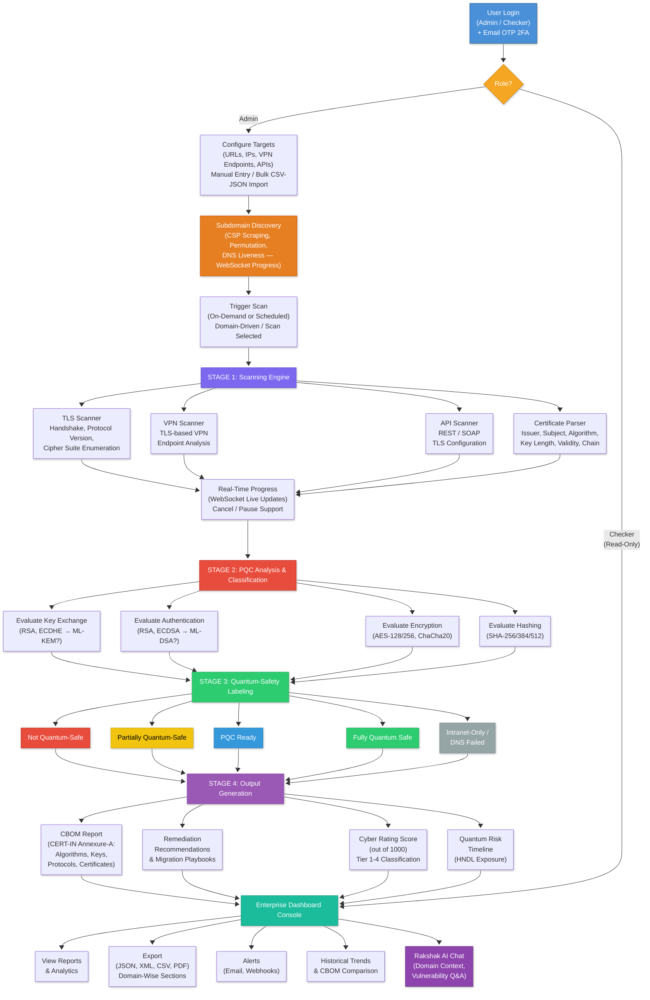

## **Date: **10/04/2026

# Software Requirement Specification (SRS)
**PSB Hackathon 2026**

**Version 1.1**

**Project Name:** Rakshak  
**Team Name:** Gabrus
**Institute Name:** Indian Institute of Technology, Kharagpur

## Revision History

| Version No | Date | Prepared by/Modified by | Significant Changes |
| :--- | :--- | :--- | :--- |
| Draft V1.0 | 13/03/26 | Sheersh Nigam, Akshat Jiwrajka, Arunangshu Karmakar, Simarpreet Singh | First Draft |
| V1.0 | 26/03/26 | Sheersh Nigam, Akshat Jiwrajka, Arunangshu Karmakar, Simarpreet Singh | Audit corrections against deployed prototype: corrected PQC label taxonomy (Partially Quantum-Safe replaces Quantum-Safe); corrected FR-11 label definitions and decision tree to match Platform Guide; added FR-11a Weakest-Link Downgrade Rule; added FR-26a User Management page; updated FR-25 to activity-based idle timeout; updated FR-26 to tamper-evident audit log hashing; updated FR-27/FR-29 sidebar and global search; expanded §3.2.3 REST API table from 21 to 42 endpoints; removed unimplemented features (Slack delivery, NTP integration, Dynamic Scan Throttling NFR, Plugin Architecture NFR); corrected operating environment to SQLite on AWS EC2; updated §4.1 to include all 4 export formats (JSON, XML, CSV, PDF); added new features (Platform Guide, User Management, Dark/Light Theme, Smart CBOM Routing, §4.4 deployment section). |
| V1.1 | 10/04/26 | Sheersh Nigam, Akshat Jiwrajka, Arunangshu Karmakar, Simarpreet Singh | Major feature additions: **AI Chat Assistant** (Rakshak AI) — domain-aware conversational chatbot powered by Gemini Flash for vulnerability analysis and migration guidance (FR-51 through FR-54, SF-10); **Two-Factor Authentication (2FA)** — email-based OTP verification on login (FR-22b); **Advanced Subdomain Discovery Engine** — multi-source enumeration with CSP scraping, permutation generation, DNS liveness checks, and real-time WebSocket progress (FR-37a, FR-37b); **Domain-driven scanning** — root domain grouping, hierarchical collapsible domain views, and "Scan Selected" bulk operations across inventory and discovery (FR-35a); **Scan lifecycle management** — cancellation with state machine (queued/running/cancelling/cancelled), per-target diagnostic breakdown (FR-08a); **New PQC labels** — `intranet_only` and `dns_failed` for unreachable/firewalled assets (FR-07 updated, FR-11 updated); **Domain-scoped reporting** — PDF reports with domain-wise summary sections and subdomain coverage tables (FR-18a); **CBOM domain filtering** — filter CBOM snapshots by root domain and view per-target CBOM history (FR-13a); **Cascading asset cleanup** — bulk delete of assets with automatic removal of linked scans, CBOM snapshots, chat sessions, and discovery records; **Individual asset cyber scores** — per-asset score table on the Cyber Rating page (FR-50a); expanded REST API table from 42 to 58+ endpoints including chat, subdomain WebSocket, domain context, OTP verification, scan details, CBOM history, and bulk delete endpoints; added `domain_service.py`, `cleanup_service.py`, `subdomain_service.py`, `domain_tools.py` utility modules; new database models: `ChatSession`, `ChatMessage`; updated `User` model with OTP fields; updated `Report`/`ScheduledReport` models with `asset_ids_json` and `domains_json` for domain-scoped reports. |

## Declaration
The purpose of this Software Requirements Specification (SRS) document is to identify and document the user requirements for our platform **Rakshak**. The end deliverable software that will be supplied by our team **Gabrus** will comprise of all the requirements documented in the current document and will be operated in the manner specified in the document. The Source code will be developed subsequently based on these requirements and will formally go through code review during testing process.

**Team Member Details:**

|    Member 1    |    Member 2     |      Member 3       |     Member 4     |
| :------------: | :-------------: | :-----------------: | :--------------: |
|   Team Lead    |    Developer    |       Analyst       |      Tester      |
| Sheersh Nigam  | Akshat Jiwrajka | Arunangshu Karmakar | Simarpreet Singh |
| IIT Kharagpur  |  IIT Kharagpur  |    IIT Kharagpur    |  IIT Kharagpur   |
|  10/04/26 |  10/04/26  |    10/04/26    |   10/04/26  |

---

## Table of Content

1. [Introduction](#1-introduction)
   - 1.1 [Purpose](#11-purpose)
   - 1.2 [Scope](#12-scope)
   - 1.3 [Intended Audience](#13-intended-audience)
2. [Overall Description](#2-overall-description)
   - 2.1 [Product Perspective](#21-product-perspective)
   - 2.2 [Product Functions](#22-product-functions)
   - 2.3 [User Classes and Characteristics](#23-user-classes-and-characteristics)
   - 2.4 [Operating Environment](#24-operating-environment)
   - 2.5 [Design and Implementation Constraints](#25-design-and-implementation-constraints)
   - 2.6 [Assumptions and Dependencies](#26-assumptions-and-dependencies)
3. [Specific Requirements](#3-specific-requirements)
   - 3.1 [Functional Requirements](#31-functional-requirements)
   - 3.2 [External Interface Requirements](#32-external-interface-requirements)
      - 3.2.1 [User Interfaces](#321-user-interfaces)
      - 3.2.2 [Hardware Interfaces](#322-hardware-interfaces)
      - 3.2.3 [Software / Communication Interfaces](#323-software--communication-interfaces)
   - 3.3 [System Features](#33-system-features)
   - 3.4 [Non-functional Requirements](#34-non-functional-requirements)
      - 3.4.1 [Performance Requirements](#341-performance-requirements)
      - 3.4.2 [Software Quality Attributes](#342-software-quality-attributes)
      - 3.4.3 [Other Non-functional Requirements](#343-other-non-functional-requirements)
4. [Technological Requirements](#4-technological-requirements)
   - 4.1 [Technologies used in development of the web application](#41-technologies-used-in-development-of-the-web-application)
   - 4.2 [I.D.E. (Integrated Development Environment)](#42-ide-integrated-development-environment)
   - 4.3 [Database Management Software](#43-database-management-software)
   - 4.4 [Deployment Environment](#44-deployment-environment)
5. [Security Requirements](#5-security-requirements)
   - [Annexure-A (CERT-IN CBOM elements)](#annexure-a-cert-in-cbom-elements)

---

## 1. Introduction

### 1.1 Purpose
To develop a quantum-proof cryptographic scanner that
discovers, inventories, and validates the cryptographic posture of public-facing
banking applications against NIST PQC standards.

### 1.2 Scope
This document is prepared with the following objectives:
* To provide behaviour of the system.
* To provide Process Flow charts.
* Discover cryptographic inventory (TLS certificates, VPN endpoints, APIs).
* Identify cryptographic controls (cipher suites, key exchange mechanisms, TLS versions).
* Validate whether deployed algorithms are quantum-safe.
* Generate actionable recommendations for non-PQC ready assets.
* Issue digital labels: Not Quantum-Safe, Partially Quantum-Safe, PQC-Ready, Fully Quantum Safe, Intranet-Only, or DNS Failed.
* Provide advanced subdomain discovery with multi-source enumeration (CSP scraping, DNS brute-force, permutation generation) and real-time WebSocket progress tracking.
* Offer a domain-aware AI Chat Assistant powered by Google Gemini Flash for interactive vulnerability analysis and PQC migration guidance.
* Enforce two-factor authentication (2FA) via email-based OTP for all user logins.
* Enterprise-wide console for central management: A GUI console to display status of scanned systems (public facing applications) covering details mentioned in Annexure-A (CERT-IN CBOM Elements).
* As per the variation of score (like High, Medium, Low rating etc) for any public applications, dashboard should display that change as well.

#### System Process Flow

### 1.3 Intended Audience
The intended audience of this document is business and technical users from Punjab National Bank (PNB) and IIT Kanpur evaluators.

---

## 2. Overall Description

### 2.1 Product Perspective

**Rakshak** is a new, standalone quantum-proof cryptographic scanner introduced into Punjab National Bank's cybersecurity ecosystem. It does not replace any existing system; rather, it adds a new capability — the ability to discover, inventory, and validate the cryptographic posture of all public-facing applications (Web Servers, APIs, and Systems including TLS-based VPNs) against NIST Post-Quantum Cryptography (PQC) standards (FIPS 203/204/205).

**Why it is needed:** With the rapid digitalization of banking, PNB's critical applications are publicly accessible 24×7. While secured by classical cryptographic algorithms (RSA, ECC) today, these are vulnerable to the emerging quantum computing threat. Adversaries can execute **"Harvest Now, Decrypt Later" (HNDL)** attacks — intercepting encrypted data now for decryption once quantum computers mature. Rakshak provides proactive defense by identifying vulnerable assets and guiding PNB's transition to quantum-safe cryptography.

**System positioning:** Rakshak is deployed within PNB's intranet with outbound access to public-facing endpoints on port 443 for scanning. It performs **passive, non-intrusive** TLS handshakes only — no write operations on target systems and no disruption to live banking services. It exposes a REST API layer (HTTPS/JSON) enabling future integration with existing SIEM platforms or security dashboards, and supports Webhook notifications for pushing alerts to external systems.

**Data flow:** Targets are scanned → cryptographic details extracted (TLS versions, cipher suites, certificates, key exchange mechanisms) → evaluated against NIST PQC standards → a **Cryptographic Bill of Materials (CBOM)** is generated per CERT-IN Annexure-A → quantum-safety labels are assigned → actionable remediation recommendations are produced — all presented through an enterprise-wide web console with dashboards, risk ratings, and exportable reports.

**Users:** Two roles — **Admin** (cybersecurity teams, IT administrators — full access) and **Checker** (compliance auditors, risk managers — read-only access).

**External dependencies:** SMTP server (email notifications, password recovery, and OTP delivery); Google Gemini Flash API (AI Chat Assistant).

### 2.2 Product Functions
1. **Target input** (URLs, IPs, TLS-based VPN endpoints, APIs) with input validation and bulk CSV/JSON import
2. **TLS scanning** — perform TLS handshakes, extract protocol version, and enumerate all supported cipher suites using a dual-engine approach (sslyze + OQS Docker probe)
3. **TLS-based VPN endpoint scanning** — assess cryptographic posture of VPN services
4. **API endpoint scanning** — discover and validate TLS configurations of REST and SOAP-based APIs
5. **Certificate analysis** — extract and parse certificate details (issuer, subject, signature algorithm, public key, validity, chain) including X.509 OID-based PQC detection
6. **Real-time scan monitoring** — WebSocket-based live progress updates with per-target status and ETA; scan cancellation support with state machine (queued → running → cancelling → cancelled)
7. **PQC classification** — classify the quantum-safety status of each cryptographic component based on NIST PQC standards (FIPS 203/204/205), using a cert-chain OID walk as the primary detection signal; includes `intranet_only` and `dns_failed` labels for unreachable/firewalled assets
8. **Weakest-Link Downgrade Rule** — automatically forces a "Critical / Not Quantum-Safe" rating if any legacy protocol (TLS 1.0/1.1, SSL 2.0/3.0) or broken cipher (RC4, 3DES, NULL) is detected on the asset
9. **CBOM generation** — produce Cryptographic Bill of Materials per CERT-IN Annexure-A (Algorithms, Keys, Protocols, Certificates)
10. **CBOM snapshot comparison** — compare two CBOM snapshots to track cryptographic posture changes over time
11. **CBOM domain filtering** — filter CBOM snapshots by root domain and view per-target CBOM history
12. **Certificate chain visualization** — per-certificate OID-level quantum-safety status shown inline in the CBOM drill-down view
13. **Labeling** — assign labels: Not Quantum-Safe, Partially Quantum-Safe, PQC Ready, Fully Quantum Safe, Intranet-Only, or DNS Failed
14. **Actionable recommendations** — generate specific algorithm migration steps for non-PQC ready assets
15. **Automated PQC migration playbooks** — step-by-step migration guides tailored per asset
16. **Quantum risk timeline** — projected vulnerability timeline based on quantum computing advancement estimates
17. **Authentication & access control** — login with email-based OTP two-factor authentication (2FA), password recovery, Role-Based Access Control (Admin / Checker), session management with 30-minute idle timeout, and audit logging
18. **Home overview dashboard** — high-level summaries of asset counts, PQC adoption %, CBOM vulnerabilities, and cyber rating
19. **Dashboard navigation** — persistent sidebar, global search with smart CBOM routing, and time period filters
20. **Asset inventory management** — maintain, search, sort, and manage all public-facing assets with risk levels and certificate details; hierarchical collapsible domain grouping for high-volume subdomain results
21. **Asset discovery** — discover assets across domains, SSL certificates, IP/subnets, and software with network topology visualization
22. **Advanced subdomain discovery** — multi-source subdomain enumeration engine using CSP header scraping, permutation generation, and DNS liveness verification with real-time WebSocket progress; auto-injection of discovered live subdomains into the scan queue
23. **Domain-driven scanning** — group assets by root domain, "Scan Selected" bulk operations, and auto-expansion of root domain scans to include discovered subdomains
24. **PQC posture module** — compliance dashboard (Elite-PQC Ready, Standard, Legacy, Critical) with risk overview and improvement recommendations
25. **Cyber rating** — consolidated enterprise-level score (out of 1000) with compliance matrix (Tier 1–4); individual per-asset cyber score table
26. **Enterprise reporting & export** — scheduled and on-demand reports in PDF, CSV formats with report history; domain-scoped reports with domain-wise summary sections and subdomain coverage tables
27. **Webhook / API notifications** — push real-time alerts on scan completion, critical findings, or certificate expiration to external systems
28. **Platform Guide** — built-in reference page explaining PQC posture definitions, label criteria (FR-11), and risk level descriptions
29. **User Management** — Admin-only panel to view all users, add new Admin/Checker accounts, and review tamper-evident audit logs with cryptographic hash per entry
30. **Dark / Light Theme** — persistent theme toggle accessible from the top navigation bar
31. **Rakshak AI Chat Assistant** — domain-aware conversational AI chatbot powered by Google Gemini Flash for interactive vulnerability analysis, migration guidance, and domain intelligence queries; supports domain context injection, copy/retry actions, and security-focused dynamic "thinking" indicators
32. **Cascading asset cleanup** — bulk deletion of assets with automatic removal of all linked records (scans, CBOM snapshots, chat sessions, discovery records, nameserver records)

### 2.3 User Classes and Characteristics
* **Primary Users:** Bank cybersecurity teams, IT administrators.
* **Secondary Users:** Compliance auditors, risk managers.
* Users are expected to have technical knowledge of cryptography and networking.

| User at | User Type | Menus for User |
| :--- | :--- | :--- |
| PNB / IIT Kanpur officials | Admin User | Full Access: Home, Asset Inventory, Asset Discovery, CBOM, Posture of PQC, Cyber Rating, Reporting, Rakshak AI Chat, User Management. |
| PNB | Checker | Read-Only Access: Home, Asset Inventory, Asset Discovery, CBOM, Posture of PQC, Cyber Rating, Rakshak AI Chat, Export Reports. |

### 2.4 Operating Environment
The operating environment for **Rakshak** is as listed below.
* **Server system:** Containerized environment (Docker) deployed on an AWS EC2 Virtual Server (production) or any Virtual Machine capable of running Python 3.11+ applications.
* **Operating system:** Linux (Ubuntu 22.04 LTS or higher) is required for the production server; Linux or Windows can be used for local development.
* **Database:** SQLite (both local development and current production deployment). The schema is designed for forward-compatibility with PostgreSQL for future enterprise scaling.
* **Platform:** Web-based application built on the FastAPI (async) framework, serving Jinja2 HTML templates and a REST API.
* **Technology:** Python 3.11+ (core engine), `sslyze` (TLS scanning), `openquantumsafe/curl` Docker image (PQC detection via liboqs), and the Python `cryptography` library (X.509 certificate parsing).
* **API:** RESTful API architecture facilitating communication between the scanning engine, the database, and the frontend dashboard. WebSocket endpoints for real-time scan progress and subdomain discovery progress.
* **AI Integration:** Google Gemini Flash API for powering the domain-aware AI Chat Assistant.
* **Deployment (Production):** AWS EC2 Virtual Server — live at [https://rakshak.live](https://rakshak.live). The Docker socket is mounted in the container to allow the OQS probe to spawn child containers.

### 2.5 Design and Implementation Constraints
**1. Technical Constraints (Deployment):**
* **Network Configuration:** The application requires outbound network access strictly over port 443 (HTTPS/TLS) to successfully reach and scan public-facing target endpoints. The application must be deployed within a private intranet, requiring appropriate firewall rules to allow outbound scanning while restricting unauthorized inbound access.
* **Hosting Environment:** The system must be hosted on an internal, secure intranet server so that the centralized management dashboard is never directly exposed to the public internet.

**2. Security Constraints**
* **Access Control:** Implementation of Role-Based Access Control (RBAC) is mandatory. The system must enforce separation of duties, supporting at least two distinct roles: 'Admin' (full access to schedule scans and manage targets) and 'Checker' (read-only access to view reports and verify compliance)
* **Data Encryption:** All data transmitted between the user's web browser and the internal dashboard must be encrypted using HTTPS (TLS 1.2 or higher).
* **Passive Scanning Protocol:** The scanner must operate in a strictly read-only, passive mode. It must not disrupt live banking services, execute intrusive payloads, or attempt to write/modify target configurations.

**3. Performance Constraints**
* **Concurrency and Throughput:** The backend scanning engine must be highly concurrent, capable of handling 50+ target endpoints simultaneously without causing severe degradation in the dashboard's responsiveness.
* **Failover Mechanisms:** The scanning engine should be designed statelessly. In the event of a failure, the application must be able to restart, recover safely, and retrieve its last known state from the database backups.

**4. User Interface Constraints**
* **User Experience Consistency:** The web dashboard must be fully responsive and maintain intuitive, consistent design elements. It must clearly present complex cryptographic data (e.g., CBOM tables, PQC status badges) so that no specialized training is required for basic operations.

**5. Domain-Specific Constraints**
* The logic analyzer must strictly comply with NIST Post-Quantum Cryptography (PQC) standards (FIPS 203, 204, 205) and adhere to CERT-In guidelines for Cryptographic Bill of Materials (CBOM) generation.
* The scanner is restricted to operating exclusively on public-facing applications (Web Servers, APIs, TLS-based VPNs).
* The system must not disrupt live banking services.
* The system must be able to export its scan results and CBOM inventories in machine-readable formats (JSON, XML, CSV, and PDF) to allow integration with other banking compliance tools.

### 2.6 Assumptions and Dependencies
**Assumptions:**
* **Standard Browser Support-** It is assumed that bank officials and end-users will access the application dashboard using modern, HTML5-compliant web browsers such as Google Chrome (version 90+).
* **Protocol Uniformity-** It is assumed that TLS-based communication is actively implemented across all targeted public-facing applications (HTTP over TLS, TLS-VPNs).
* **Network Connectivity-** The underlying server hosting the scanner is assumed to have stable, continuous internet connectivity to successfully probe external endpoints.

**Dependencies:**
* **Core Software Stack-** The application is heavily dependent on Python 3.11+ and specialized third-party libraries (`sslyze` for protocol enumeration and `cryptography` for certificate parsing). Any deprecation or breaking changes in these libraries will require immediate system updates.
* **Database System-** The application relies on SQLite for persistent data storage in the current prototype deployment (on AWS EC2). Any maintenance, downtime, or performance bottlenecks within the database will directly impact the application's ability to generate reports or retrieve scan histories. PostgreSQL is planned for future enterprise-scale deployment.
* **Cryptographic Standard Finalization-** The analyzer's rule engine depends on the finalized NIST PQC algorithms (e.g., ML-KEM, ML-DSA, SLH-DSA) acting as the definitive source of truth for quantum-safe validation.

---

## 3. Specific Requirements

### 3.1 Functional Requirements

#### Core Scanning & Analysis

| ID | Requirement |
|:---|:---|
| **FR-01** | The system shall accept target inputs including URLs, IP addresses, TLS-based VPN endpoints, and API endpoints for scanning. |
| **FR-02** | The system shall perform a TLS handshake with each target and extract the negotiated protocol version (TLS 1.0, 1.1, 1.2, 1.3). |
| **FR-03** | The system shall enumerate all cipher suites supported by each target, including key exchange, authentication, encryption, and hashing algorithms. |
| **FR-04** | The system shall extract and parse certificate details including issuer name, subject name, signature algorithm, public key algorithm, key length, validity period (Not Valid Before / Not Valid After), and certificate chain. |
| **FR-05** | The system shall discover and scan TLS-based VPN endpoints to assess their cryptographic posture. |
| **FR-06** | The system shall discover and validate API endpoint TLS configurations, including REST and SOAP-based services. |
| **FR-07** | The system shall classify each cryptographic component's quantum-safety posture and assign exactly one of six labels: **Not Quantum-Safe**, **Partially Quantum-Safe**, **PQC-Ready**, **Fully Quantum Safe**, **Intranet-Only** (DNS resolves but port is firewalled / intranet-only), or **DNS Failed** (hostname does not resolve in public DNS) — based on NIST PQC standards (FIPS 203/204/205) and the cert-chain OID walk described in FR-11. |
| **FR-08** | The system shall provide **Real-Time Scan Monitoring** via WebSocket-based live progress updates, showing per-target scan status, current phase (handshake, cipher enumeration, cert parsing), and ETA. |
| **FR-08a** | The system shall support **Scan Lifecycle Management** with a state machine (Queued → Running → Cancelling → Cancelled / Completed / Failed). Users shall be able to cancel running or queued scans. The system shall provide a per-target diagnostic breakdown showing succeeded, intranet-only, DNS-failed, and error targets for each scan. |
| **FR-09** | The system shall perform **Input Validation** on all target inputs (URL format, IP address format, CIDR notation, port ranges) before initiating scans, rejecting malformed entries with descriptive error messages. |

#### CBOM & Labeling

| ID | Requirement |
|:---|:---|
| **FR-10** | The system shall generate a Cryptographic Bill of Materials (CBOM) per CERT-IN Annexure-A format, covering all four asset categories: Algorithms, Keys, Protocols, and Certificates with their mandatory fields. |
| **FR-11** | The system shall evaluate each scanned asset's cryptographic posture and assign exactly one of the following labels (listed from least to most quantum-ready): |
| **FR-12** | The system shall generate actionable remediation recommendations for each asset classified as "Not Quantum-Safe" or "Partially Quantum-Safe", including specific algorithm migration steps (e.g., "Upgrade key exchange from ECDHE to ML-KEM-768 (FIPS 203)"). |
| **FR-13** | The system shall support **CBOM Snapshot Comparison** — allowing users to compare two CBOM snapshots taken at different times to track cryptographic posture changes, newly added/removed assets, and migration progress. |
| **FR-13a** | The system shall support **CBOM Domain Filtering** — allowing users to filter CBOM snapshots by root domain and view per-target CBOM history with timestamped snapshot records. |
| **FR-14** | The system shall provide **Certificate Chain Visualization** — an interactive tree/graph view showing the full certificate chain from leaf to root CA, with quantum-safety status color-coded at each level. |

**FR-11 — Label Definitions:**

> **Weakest-Link Rule (FR-11a):** If a scanned asset supports any legacy protocol (SSL 2.0, SSL 3.0, TLS 1.0, TLS 1.1) or broken cipher (RC4, 3DES, DES, NULL, MD5), the asset shall be automatically downgraded to **Not Quantum-Safe / Critical** regardless of any PQC primitives also detected. This prevents false-positive safe ratings on downgrade-vulnerable endpoints.

| Label | Criteria | Real-World Example |
|:---|:---|:---|
| 🔴 **Not Quantum-Safe** | **No PQC detected anywhere** — neither in the negotiated TLS cipher suite (key exchange) nor in any X.509 certificate chain OID. The connection relies entirely on classical cryptography vulnerable to Shor's algorithm. Also applied by the Weakest-Link Rule when any legacy protocol or broken cipher is present. | ECDHE key exchange + RSA/ECDSA certificate + AES-256-GCM. Scan targets: `google.com`, `badssl.com`. |
| 🟡 **Partially Quantum-Safe** | **PQC detected in one layer only.** At least one PQC algorithm has been detected — either in the negotiated cipher suite (ML-KEM key exchange) *or* from the server's leaf certificate signature OID (ML-DSA, SLH-DSA) — but not across both layers simultaneously. Data may be protected against HNDL, but identity authentication or KEX remains classical. | ML-KEM-768 key exchange with a classical RSA identity certificate. Scan target: `kms.us-east-1.amazonaws.com`. |
| 🔵 **PQC-Ready** | **PQC in both KEX and leaf certificate auth.** Both the key exchange and the leaf certificate's authentication use PQC algorithms (verified via real X.509 OID parsing). However, at least one Intermediate or Root CA in the trust chain still uses a classical signature, preventing end-to-end quantum resilience. | ML-DSA-65 leaf certificate (OID: 2.16.840.1.101.3.4.3.18) + ML-KEM key exchange, but a Root CA signed with RSA-2048. Scan target: `scans.rakshak.live:4433`. |
| 🟢 **Fully Quantum-Safe** | **End-to-end PQC.** Every certificate in the trust chain (Leaf → Intermediate → Root CA) uses a NIST-standardized PQC signature OID (ML-DSA, SLH-DSA, or FN-DSA). No classical asymmetric cryptography remains in any layer of the connection. | ML-DSA-65 leaf + ML-DSA-87 Intermediate + ML-DSA-87 Root CA — entire chain verified via NIST OID inspection. Scan target: `test.openquantumsafe.org:6182`. |
| ⚫ **Intranet-Only** | **Target is firewalled.** DNS resolves but the port is not reachable from the scanning server — the target is behind a firewall or on a private intranet. No cryptographic assessment is possible. | Corporate intranet applications, private VPN endpoints. |
| ⬛ **DNS Failed** | **Hostname does not resolve.** The hostname does not have a valid DNS A/AAAA record in public DNS. The target may be decommissioned, misconfigured, or an internal-only name. | Stale subdomain entries, typo domains. |

> **Note on X25519:** X25519 (Curve25519) is classified as a classical/vulnerable key exchange algorithm — it is not quantum-safe and does not qualify for any PQC label. Only NIST-standardized PQC algorithms (ML-KEM per FIPS 203, ML-DSA per FIPS 204, SLH-DSA per FIPS 205, Falcon/FN-DSA) qualify.

#### Reporting & Export

| ID | Requirement |
|:---|:---|
| **FR-15** | The system shall export scan reports in JSON, XML, and CSV formats. |
| **FR-16** | The system shall provide an enterprise-wide console displaying the status of all scanned systems with High/Medium/Low risk ratings (mapped to the Cyber Rating tiers defined in FR-47 through FR-49) per Annexure-A. |
| **FR-17** | The system shall support both **Scheduled Reporting** (recurring reports at configurable frequency — daily, weekly, monthly) and **On-Demand Reporting** (immediate generation). |
| **FR-18** | The system shall allow users to configure report contents by selecting which modules to include (Asset Discovery, Asset Inventory, CBOM, PQC Posture, Cyber Rating). |
| **FR-18a** | The system shall support **Domain-Scoped Reporting** — allowing users to select specific domains and/or individual assets for report generation. PDF reports shall include a domain-wise summary section with per-domain target counts, scanned/live/dead breakdown, and subdomain-level CBOM tables. |
| **FR-19** | The system shall support multiple report delivery channels: **email** (SMTP delivery with attachment) and **local** (file saved to server directory). |
| **FR-20** | The system shall support PDF report generation with optional password protection and chart/graph inclusion. |
| **FR-21** | The system shall implement **Webhook / API Notifications** allowing external systems to receive real-time alerts on scan completion, critical findings, or certificate expiration warnings. |

#### Authentication & Access Control

| ID | Requirement |
|:---|:---|
| **FR-22** | The system shall provide a login screen requiring email/username and password for authentication. |
| **FR-22b** | The system shall implement **Two-Factor Authentication (2FA)** via email-based One-Time Password (OTP). Upon successful credential verification, a 6-digit OTP shall be generated, emailed to the user's registered email address, and expire after 5 minutes. The user must enter the correct OTP to complete login and receive a JWT token. Designated demo/bypass accounts may skip OTP for evaluation purposes. |
| **FR-23** | The system shall implement a "Forgot Password" recovery mechanism via email (password reset link sent to registered email). |
| **FR-24** | The system shall enforce Role-Based Access Control (RBAC) with at least two roles: **Admin** (full access — configure targets, schedule scans, manage users, view audit logs) and **Checker** (read-only — view reports, verify compliance). |
| **FR-25** | The system shall enforce **Session Management** policies including: activity-based idle timeout (30 minutes of inactivity), automatic logout after idle period, and token-based session verification on every page load. |
| **FR-26** | The system shall maintain **Tamper-Evident Audit Logs** recording all significant events including: user login/logout, scan initiation/completion, report generation, asset additions/modifications, and configuration changes — each with user ID, username, timestamp, IP address, event type, event details, and a cryptographic hash to ensure immutability. |
| **FR-26a** | The system shall provide a **User Management** page (Admin-only) displaying all registered users with their ID, username, email, role (Admin/Checker), active status, and last login timestamp, with the ability to add new users and view audit logs. |

#### Dashboard & Navigation

| ID | Requirement |
|:---|:---|
| **FR-27** | The system shall provide a persistent sidebar navigation menu with links to: Home, Asset Inventory, Asset Discovery, CBOM, Posture of PQC, Cyber Rating, Reporting, Rakshak AI Chat, Platform Guide (reference documentation), and Users (Admin-only User Management). |
| **FR-28** | The system shall provide a **Home Overview Dashboard** displaying high-level summaries including: total asset discovery counts, PQC adoption percentage, CBOM vulnerability count, Cyber Rating score, and a PQC Posture Distribution donut chart. |
| **FR-29** | The system shall provide a **Global Search** bar enabling users to search across domains, URLs, IP addresses, contacts, Indicators of Compromise (IoCs), and other assets. When a user selects an asset from search results, the system shall navigate directly to the latest CBOM snapshot for that asset (Smart Asset-to-CBOM Routing). |
| **FR-30** | The system shall provide a **Time Period Filter** allowing users to specify start and end dates to filter all displayed dashboard data. |

#### Asset Inventory Module

| ID | Requirement |
|:---|:---|
| **FR-31** | The system shall maintain an **Asset Inventory** displaying top-level metrics for Public Web Apps, APIs, Servers, and Total Assets. |
| **FR-32** | The system shall display visual distribution charts for: Asset Risk levels, Expiring Certificates timeline, IP Version Breakdown (IPv4 vs IPv6), and Asset Type Distribution (Critical, High, Medium, Low). |
| **FR-33** | The system shall provide a searchable, sortable data table listing all inventoried assets with columns: Asset Name, URL, IPv4/IPv6 Address, Type, Owner, Risk Level, Certificate Status, Key Length, and Last Scan Timestamp. |
| **FR-34** | The system shall display Nameserver Records including Domain, Hostname, IP Address, Record Type, IPv6 Address, Asset association, TTL, Key Length, Cipher Suite (TLS), and Certificate Authority. |
| **FR-35** | The system shall allow users to manually **Add Assets** and trigger a **Scan All** action across all inventoried assets. |
| **FR-35a** | The system shall support **Domain-Driven Asset Operations** — grouping assets by root domain in collapsible accordion rows, supporting "Scan Selected" bulk operations on selected domains/subdomains, and cascading bulk delete of assets with automatic removal of all linked records (scan results, CBOM snapshots, chat sessions, discovery records, and nameserver records). |
| **FR-36** | The system shall support **Bulk Target Import** via CSV or JSON file upload, enabling administrators to onboard large numbers of targets at once. |

#### Asset Discovery Module

| ID | Requirement |
|:---|:---|
| **FR-37** | The system shall provide an **Asset Discovery** module with categorized tabs for Domains, SSL Certificates, IP Address/Subnets, and Software. |
| **FR-37a** | The system shall provide an **Advanced Subdomain Discovery Engine** — a multi-source enumeration pipeline that discovers subdomains via DNS brute-force wordlist probing, CSP (Content Security Policy) header scraping from live web pages, and smart permutation generation (environment-specific guesses such as dev, api, staging, test prefixes). The engine shall verify each candidate subdomain via DNS A/AAAA record resolution and classify results as "live" or "dead". |
| **FR-37b** | The system shall provide **Real-Time Subdomain Discovery Progress** via a dedicated WebSocket endpoint (`/ws/subdomain/{job_id}`), streaming phase updates (dns_brute, csp_scrape, permutation, dns_verify, completed/failed) and discovered hostnames to the client in real-time. Discovered live subdomains shall be automatically injected into the asset inventory and optionally queued for vulnerability scanning. |
| **FR-38** | The system shall support status filtering of discovered assets: New, False Positive/Ignore, Confirmed, Live Only, and All. |
| **FR-39** | The system shall display detailed discovery tracking tables for each category: Registration Date and Registrar for Domains; Fingerprint and Certificate Authority for SSL; Location, Subnet, ASN, and Netname for IPs. |
| **FR-40** | The system shall render a **Visual Network Topology Graph** mapping connections between IPs, SSL certificates, Web servers, Domains, and scanning tags. |

#### PQC Posture Module

| ID | Requirement |
|:---|:---|
| **FR-41** | The system shall provide a **PQC Compliance Dashboard** categorizing assets into: Elite-PQC Ready, Standard, Legacy, and Critical. |
| **FR-42** | The system shall display Risk Overview charts and Application Status tracking within the PQC module. |
| **FR-43** | The system shall display actionable **Improvement Recommendations** within the PQC Posture module UI, surfacing the remediation steps generated by FR-12 in a categorized panel (e.g., upgrading to TLS 1.3 with PQC cipher suites, implementing ML-KEM for key exchange, updating cryptographic libraries, developing a PQC Migration Plan). |
| **FR-44** | The system shall display detailed individual app profiles showing PQC Support status, Ownership, Exposure level, TLS type, and an assigned Score/Status. |
| **FR-45** | The system shall generate a **Quantum Risk Timeline** — a projected timeline visualization showing when each asset's current cryptographic algorithms are expected to become vulnerable based on quantum computing advancement projections (NIST/CISA estimates), highlighting exposure to **Harvest Now, Decrypt Later (HNDL)** attacks where adversaries intercept encrypted data today for future quantum decryption. |
| **FR-46** | The system shall provide **Automated PQC Migration Playbooks** — auto-generated step-by-step migration guides per asset, tailored to its current cipher suite and target PQC algorithms, with estimated effort and risk assessment. |

#### Cyber Rating Module

| ID | Requirement |
|:---|:---|
| **FR-47** | The system shall compute and display a **Consolidated Enterprise-Level Cyber-Rating Score** as a numerical metric (out of 1000) with a visual dial/gauge indicator. |
| **FR-48** | The system shall maintain a classification table mapping asset status (Legacy, Standard, Elite-PQC) to specific numerical score ranges. |
| **FR-49** | The system shall implement a **Compliance Matrix** defining tiers: Tier 1 (Elite), Tier 2 (Standard), Tier 3 (Needs Improvement), Tier 4 (Critical) — each with defined Security Level, Compliance Criteria (TLS version, cipher strength), and Priority/Action. |
| **FR-50** | The system shall provide a **Historical Trend Analysis** dashboard tracking the organization's overall quantum-readiness score over time with trend lines, showing improvement or regression. |
| **FR-50a** | The system shall display an **Individual Asset Score Table** on the Cyber Rating page, showing each asset's individual cyber score alongside its PQC label, enabling per-asset drill-down on the enterprise rating. |

#### AI Chat Assistant Module (Rakshak AI)

| ID | Requirement |
|:---|:---|
| **FR-51** | The system shall provide a **Rakshak AI Chat Assistant** — a conversational AI chatbot powered by Google Gemini Flash, accessible from the sidebar, enabling users to ask natural-language questions about vulnerability analysis, PQC migration guidance, and domain-level intelligence. |
| **FR-52** | The system shall support **Domain-Scoped Chat Sessions** — each chat session can be bound to a specific root domain, automatically injecting enriched context (live targets, dead hosts, CBOM summaries, scan results, recommendations, and playbook data for all subdomains under that domain) into the AI's system prompt. The AI shall enforce scope boundaries and only answer queries about the selected domain. |
| **FR-53** | The system shall provide a **Domain Context Selector** — a searchable, collapsible domain tree widget allowing users to select a root domain for the chat session. The selector shall display live/dead/scanned counts per domain and filter for domains with inventory-backed targets. |
| **FR-54** | The system shall support **Chat Interaction Controls** — each AI response shall include Copy and Retry action buttons. The chat input shall display a dynamic, context-aware loading indicator with randomized security-focused verbs (Analyzing, Assessing, Reviewing, Scanning, Auditing, Investigating, Evaluating, Examining, Inspecting, Processing) while the AI processes the query. Chat messages shall be persisted in the database for session continuity. |

---

### 3.2 External Interface Requirements

#### 3.2.1 User Interfaces

The application shall provide a **responsive web-based user interface** accessible via modern web browsers (Google Chrome 90+, Mozilla Firefox, Microsoft Edge). The UI shall consist of the following components:

**Global Layout:**
- A **persistent sidebar navigation** menu providing access to all modules: Home, Asset Inventory, Asset Discovery, CBOM, Posture of PQC, Cyber Rating, Reporting, Rakshak AI Chat, Platform Guide, and Users (Admin-only). A version badge ("v1.1") is displayed on the sidebar.
- A **top navigation bar** containing: global search bar, time period filter (date range selector), user profile dropdown, and notification bell icon.
- A **login page** with email/username and password fields, "Forgot Password" link, and "Sign In" button. Upon credential verification, a **6-digit OTP verification form** is displayed for Two-Factor Authentication, with a 5-minute expiry timer and resend option.

**Home Overview Dashboard:**
- Summary cards displaying key metrics: total assets discovered (domains, IPs, subdomains, cloud assets), PQC adoption percentage (circular progress indicator), CBOM vulnerability count, and Asset Inventory summary (SSL certificates, software, public-facing services).
- A Cyber Rating breakdown widget showing tier distribution (Excellent, Good, Satisfactory, Needs Improvement).

**Asset Inventory View:**
- Metric cards for Public Web Apps, APIs, Servers, and Total Assets counts.
- Interactive charts: Asset Risk distribution (pie/donut), Expiring Certificates timeline (bar), IP Version Breakdown (pie), Asset Type Distribution by severity (stacked bar).
- A searchable, sortable, paginated data table with columns: Asset Name, URL, IPv4/IPv6, Type, Owner, Risk, Cert Status, Key Length, Last Scan. Assets are grouped by root domain in **collapsible accordion rows** for high-volume subdomain management.
- Bulk selection checkboxes with "Scan Selected" and "Delete Selected" actions persisted across pagination and search.
- A Nameserver Records sub-section table.
- "Add Asset" button (opens modal form) and "Scan All" action button.

**Asset Discovery View:**
- Tabbed interface for Domains, SSL, IP Address/Subnets, and Software categories.
- Status filter bar: New, False Positive/Ignore, Confirmed, Live Only, All.
- Detailed tracking tables per category with category-specific columns. Domain results are displayed in **hierarchical collapsible groups** by root domain.
- Subdomain Discovery panel with domain input, real-time WebSocket progress streaming (phase indicators: DNS brute-force, CSP scraping, permutation, DNS verification), and auto-injection of live hosts into inventory.
- Auto-select of subdomains when a parent domain checkbox is checked.
- A **Network Topology Graph** (interactive, zoomable, drag-enabled) showing relationships between discovered assets.

**CBOM View:**
- Summary metric cards: Total Applications, Sites Surveyed, Active Certificates, Weak Cryptography count, Certificate Issues count.
- **Domain filter dropdown** to filter CBOM snapshots by root domain; unknown/unreachable assets hidden by default with toggle.
- CBOM results grouped by root domain in **collapsible accordion sections** (collapsed by default).
- Analytical charts: Cipher Usage distribution, Top Certificate Authorities, Key Length Distribution, Encryption Protocols breakdown.
- A granular mapping table showing per-application Key Length, Cipher, and Certificate Authority.
- Drill-down capability to view full Annexure-A CBOM detail per asset (all 4 categories: Algorithms, Keys, Protocols, Certificates) with per-target CBOM history.

**PQC Posture View:**
- PQC Compliance Dashboard with category cards: Elite-PQC Ready, Standard, Legacy, Critical.
- Risk Overview charts and Application Status tracking.
- Improvement Recommendations panel with actionable items.
- Individual app profile cards showing: PQC Support status, Ownership, Exposure level, TLS type, Score/Status badge.
- Quantum Risk Timeline visualization showing projected vulnerability timelines per asset.

**Cyber Rating View:**
- A large visual dial/gauge indicator showing the Consolidated Enterprise-Level Cyber-Rating Score (out of 1000).
- Classification table mapping asset status to score ranges.
- **Individual Asset Score Table** showing per-asset cyber scores alongside their PQC labels.
- Compliance Matrix grid defining Tier 1–4 with Security Level, Compliance Criteria, and Priority/Action.
- Historical trend chart showing score changes over time.

**Reporting View:**
- Toggle between Scheduled Reporting and On-Demand Reporting modes.
- Configuration form: Report Type, Frequency (Weekly/Daily/Monthly), Target Asset selection.
- **Domain and Asset selector** for domain-scoped report generation.
- Module inclusion checkboxes: Discovery, Inventory, CBOM, PQC Posture, Cyber Rating.
- Scheduling tools: Date picker, Time picker, Time Zone selector.
- Delivery settings: Email routing or local directory path.
- Output settings: File Format (PDF/JSON/XML/CSV), Password Protection toggle, Include Charts checkbox.

**Label Badges:**
- Color-coded badges displayed on assets across all views:
  - 🟢 **Fully Quantum Safe** — green badge
  - 🔵 **PQC Ready** — blue badge
  - 🟡 **Partially Quantum-Safe** — amber/yellow badge
  - 🔴 **Not Quantum-Safe** — red badge
  - ⚫ **Intranet-Only** — dark grey badge (DNS resolves but port firewalled)
  - ⬛ **DNS Failed** — black/dark badge (hostname does not resolve)
  - ⚪ **Unknown** — grey badge (target unreachable or scan failed)

**Theme Toggle:**
- A sun/moon icon in the top navigation bar allows users to switch between Light and Dark UI themes, persisted for the session.

**Rakshak AI Chat View:**
- A full-page conversational interface accessible from the sidebar.
- **Domain Context Selector** — a searchable, collapsible tree widget on the left panel displaying all root domains with live/dead/scanned target counts. Clicking a domain binds the session to that domain's context.
- **Chat Panel** — a scrollable message feed showing user queries and AI responses with markdown rendering. Each AI response includes **Copy** and **Retry** action buttons.
- **Dynamic Loading Indicator** — while the AI processes a query, a randomized security-focused verb (Analyzing, Assessing, Reviewing, Scanning, Auditing, Investigating, Evaluating, Examining, Inspecting, Processing) is displayed before animated loading dots.
- **Message Input** — a text input bar with send button at the bottom of the chat panel.
- Chat sessions are persisted per-user and per-domain for continuity.

**Scan Detail View:**
- Expandable scan history rows on the Home dashboard showing per-scan target breakdowns.
- Target diagnostic categories: Succeeded (green), Intranet-Only (grey), DNS Failed (dark), Failed/Error (red), and Running (blue spinner).
- Cancel button for active scans with real-time status transition feedback.

**Platform Guide View:**
- A dedicated reference page accessible from the sidebar explaining PQC label definitions, compliance tier criteria, and risk level descriptions for non-expert users.

#### 3.2.2 Hardware Interfaces

- The system requires a **standard server** (physical or virtual) with network access to the public internet on port **443 (HTTPS/TLS)**.
- No specialized hardware is required. The system operates entirely in software.
- The server must have a **network interface** capable of establishing outbound TCP connections to target endpoints for TLS handshakes.
- For TLS-based VPN endpoint scanning, the server must be able to reach port **443** (HTTPS/TLS). Note: Ports 500 (IKE) and 4500 (NAT-T) are UDP-based and outside the scope of TLS-based scanning.
- Minimum recommended hardware: **4-core CPU, 8 GB RAM, 50 GB disk** (scales with number of targets and historical data retention).

#### 3.2.3 Software / Communication Interfaces

**REST API Endpoints:**

The system shall expose the following REST API endpoints, communicating over **HTTPS** using **JSON** as the data interchange format:

| Method | Endpoint | Description |
|:---|:---|:---|
| `POST` | `/api/auth/login` | Authenticate user credentials and initiate OTP flow (or return JWT for bypass accounts) |
| `POST` | `/api/auth/verify-otp` | Verify the 6-digit OTP and issue JWT token upon success |
| `POST` | `/api/auth/forgot-password` | Initiate password recovery via email |
| `POST` | `/api/auth/reset-password` | Submit new password using the reset token from email |
| `POST` | `/api/auth/logout` | Invalidate the current session token |
| `POST` | `/api/auth/register` | Register a new user account (Admin-only) |
| `POST` | `/api/scan` | Submit a new scan request with target list (optional `discover_subdomains` flag for auto-expansion) |
| `POST` | `/api/scan/bulk-import` | Upload CSV/JSON file for bulk target import |
| `GET` | `/api/scan` | List all scans (paginated) with display status (includes "cancelling" state) |
| `GET` | `/api/scan/{id}/status` | Get real-time status of a running scan |
| `GET` | `/api/scan/{id}/results` | Retrieve scan results for a specific scan |
| `GET` | `/api/scan/{id}/details` | Get per-target diagnostic breakdown (succeeded, intranet-only, DNS-failed, errors, running) |
| `DELETE` | `/api/scan/{id}` | Cancel a queued/running scan or remove a completed scan |
| `GET` | `/api/assets` | List all inventoried assets (paginated, filterable by risk) |
| `POST` | `/api/assets` | Add a new asset manually |
| `DELETE` | `/api/assets/{asset_id}` | Remove an asset from inventory |
| `DELETE` | `/api/assets/bulk-delete` | Bulk delete assets by hostname with cascading removal of linked records |
| `POST` | `/api/assets/discover` | Trigger asset discovery (DNS, IP, subnet, software enumeration) |
| `POST` | `/api/assets/discover-subdomains` | Trigger advanced subdomain discovery for a root domain (CSP scrape, permutation, DNS verify) |
| `GET` | `/api/assets/subdomain-job/{job_id}` | Get status and results of a subdomain discovery job |
| `GET` | `/api/assets/metrics` | Get asset inventory metric cards (web apps, APIs, servers, total) |
| `GET` | `/api/assets/discovery` | List discovered assets with status (New / Confirmed / False Positive) |
| `PATCH` | `/api/assets/discovery/{disc_id}/status` | Update discovered asset triage status |
| `GET` | `/api/assets/nameservers` | Retrieve nameserver records for inventoried assets |
| `GET` | `/api/cbom` | List all CBOM snapshots (paginated, filterable by domain) |
| `GET` | `/api/cbom/metrics` | Get CBOM summary metrics (filterable by domain, with unknown label toggle) |
| `GET` | `/api/cbom/compare` | Compare two CBOM snapshots and return diff |
| `GET` | `/api/cbom/history` | Get CBOM snapshot history for a specific target URL |
| `GET` | `/api/cbom/{snap_id}` | Retrieve full CBOM detail for a specific snapshot |
| `GET` | `/api/cbom/cert-chain/{snap_id}` | Retrieve the parsed X.509 certificate chain for a snapshot |
| `GET` | `/api/pqc/posture` | Get PQC posture summary categorised by tier |
| `GET` | `/api/pqc/recommendations/{asset_id}` | Get PQC migration playbook for a specific asset |
| `GET` | `/api/pqc/risk-timeline/{asset_id}` | Get projected quantum risk timeline for a specific asset |
| `GET` | `/api/rating` | Get enterprise cyber rating score with tier and breakdown |
| `GET` | `/api/rating/history` | Get historical rating trend data over time |
| `POST` | `/api/reports/generate` | Generate an on-demand report (supports domain/asset selection via `asset_ids` and `domains` fields) |
| `POST` | `/api/reports/schedule` | Create a scheduled recurring report with domain/asset scope |
| `GET` | `/api/reports` | List all generated reports with status and download links |
| `GET` | `/api/reports/export/{report_id}` | Download an export of a specific generated report |
| `DELETE` | `/api/reports/{report_id}` | Delete a generated report |
| `GET` | `/api/reports/scheduled` | List all scheduled report configurations |
| `POST` | `/api/webhooks` | Register a new webhook for event notifications |
| `GET` | `/api/webhooks` | List all registered webhooks |
| `DELETE` | `/api/webhooks/{webhook_id}` | Remove a registered webhook |
| `GET` | `/api/users` | List all system users with roles and status (Admin-only) |
| `GET` | `/api/audit-logs` | Retrieve tamper-evident audit log entries (paginated) |
| `GET` | `/api/home/summary` | Get home dashboard summary (assets, PQC %, CBOM count, rating) |
| `GET` | `/api/chat/domains` | List available root domains with target/scan/dead-host counts for chat context |
| `GET` | `/api/chat/domain-context` | Get enriched domain context (targets, scans, CBOM, recommendations) for AI prompt injection |
| `GET` | `/api/chat/sessions` | List all chat sessions for the current user |
| `POST` | `/api/chat/sessions` | Create a new chat session (optionally bound to a domain or asset) |
| `GET` | `/api/chat/sessions/{session_id}/messages` | Retrieve all messages for a chat session |
| `POST` | `/api/chat/sessions/{session_id}/messages` | Send a message to the AI and receive a streamed response |
| `DELETE` | `/api/chat/sessions/{session_id}` | Delete a chat session and all its messages |
| `WebSocket` | `/ws/scan/{scan_id}` | Real-time scan progress stream |
| `WebSocket` | `/ws/subdomain/{job_id}` | Real-time subdomain discovery progress stream |

**External Service Integrations:**
- **SMTP Server** — For email-based report delivery, password recovery, and OTP dispatch.
- **Google Gemini Flash API** — For powering the Rakshak AI Chat Assistant with domain-aware vulnerability analysis and migration guidance.

**Data Formats:**
- All API request/response bodies use **JSON** (`application/json`).
- Report exports support **JSON**, **XML**, **CSV**, and **PDF** formats.
- CBOM output conforms to **CERT-IN Annexure-A** schema.

---

### 3.3 System Features

#### SF-01: Authentication & Access Control

**Description:** Provides secure login with two-factor authentication (2FA), password recovery, and role-based access control to ensure only authorized users can access the system with appropriate privilege levels.

**Stimulus/Response Sequences:**

| Stimulus | Response |
|:---|:---|
| User navigates to the application URL | System displays login page with email/password fields |
| User enters valid credentials and clicks "Sign In" | System verifies credentials and sends a 6-digit OTP to the user's registered email. System displays the OTP verification form |
| User enters the correct OTP within 5 minutes | System verifies OTP, issues JWT token, logs the login event with IP/device details, and redirects to Home Dashboard |
| User enters expired or incorrect OTP | System displays error message: "Invalid OTP code" or "OTP expired. Please log in again." |
| Designated bypass account enters valid credentials | System skips OTP flow, issues JWT token directly, and redirects to Home Dashboard |
| User enters invalid credentials | System displays error message: "Invalid email or password" |
| User clicks "Forgot Password" and enters email | System sends password reset link to registered email |
| Admin navigates to user management | System displays user list with role assignments (Admin/Checker) |
| Checker user attempts to access Admin-only feature | System denies access and displays "Insufficient permissions" message |

**Functional Requirements:** FR-22, FR-22b, FR-23, FR-24, FR-25, FR-26

---

#### SF-02: Home Overview Dashboard

**Description:** Provides a centralized, at-a-glance view of the organization's entire cryptographic posture, aggregating key metrics from all modules into a single summary page.

**Stimulus/Response Sequences:**

| Stimulus | Response |
|:---|:---|
| Authenticated user lands on Home page | System displays summary cards for Asset Discovery counts, PQC adoption %, CBOM vulnerability count, Cyber Rating, and Asset Inventory |
| User applies a time period filter | System refreshes all dashboard widgets to reflect data within the selected date range |
| User enters a search query in the global search bar | System displays matching results across domains, URLs, IPs, IoCs, and assets |

**Functional Requirements:** FR-27, FR-28, FR-29, FR-30

---

#### SF-03: Asset Inventory Management

**Description:** Maintains a comprehensive inventory of all known public-facing assets (web apps, APIs, servers), their risk levels, certificate details, and scan history. Enables both manual asset addition, bulk operations, and domain-driven management with cascading cleanup.

**Stimulus/Response Sequences:**

| Stimulus | Response |
|:---|:---|
| User navigates to Asset Inventory | System displays metric cards (Web Apps, APIs, Servers, Total) and visual distribution charts |
| User scrolls to the data table | System renders paginated, searchable table with assets grouped by root domain in collapsible accordion rows |
| User clicks "Add Asset" | System opens a modal form to input asset details (URL, IP, type, owner) |
| User fills and submits the Add Asset form | System validates input, adds asset to inventory, and queues it for scanning |
| User clicks "Scan All" | System initiates a scan across all inventoried assets and shows progress indicators |
| User selects multiple assets and clicks "Scan Selected" | System initiates a scan only for the selected assets/domains |
| User selects assets and clicks "Delete Selected" | System performs cascading deletion of selected assets and all linked records (scans, CBOM, chat sessions, discovery records, nameservers) |
| User clicks on an asset row | System navigates to a detail view with full cert chain, cipher suite, and CBOM data |

**Functional Requirements:** FR-31, FR-32, FR-33, FR-34, FR-35, FR-35a, FR-36

---

#### SF-04: Asset Discovery Engine

**Description:** Automatically discovers public-facing cryptographic assets across multiple categories (domains, SSL certificates, IP subnets, software) and maps their interconnections through a visual network topology. Includes an advanced subdomain discovery engine with multi-source enumeration and real-time progress tracking.

**Stimulus/Response Sequences:**

| Stimulus | Response |
|:---|:---|
| User navigates to Asset Discovery | System displays tabbed view (Domains, SSL, IP/Subnets, Software) with status filters. Domain results are shown in hierarchical collapsible groups |
| User selects a category tab (e.g., Domains) | System displays tracking table with Registration Date, Registrar, and other category-specific fields |
| User applies status filter (e.g., "Live Only") | System filters the table to show only DNS-verified live assets |
| User triggers subdomain discovery for a root domain | System launches the multi-source enumeration pipeline (DNS brute-force, CSP scraping, permutation generation) and streams real-time progress via WebSocket |
| Subdomain discovery completes | System classifies discovered subdomains as "live" or "dead" via DNS verification, auto-adds live hosts to asset inventory, and displays results grouped by root domain |
| User marks an asset as "False Positive / Ignore" | System updates asset status and excludes it from future scan reports |
| User marks an asset as "Confirmed" | System moves asset to confirmed inventory for active monitoring |
| User selects discovered subdomains and clicks "Scan Selected" | System queues selected subdomains for vulnerability scanning |
| User clicks "Network Topology" | System renders an interactive graph showing relationships between IPs, SSLs, servers, and domains |

**Functional Requirements:** FR-37, FR-37a, FR-37b, FR-38, FR-39, FR-40

---

#### SF-05: TLS & VPN & API Scanner Engine

**Description:** Core scanning engine that performs TLS handshakes, enumerates cipher suites, extracts certificate details, and scans VPN and API endpoints for their cryptographic posture. Supports scan lifecycle management with cancellation and per-target diagnostic breakdowns.

**Stimulus/Response Sequences:**

| Stimulus | Response |
|:---|:---|
| Admin submits a scan request with a list of targets | System queues targets, initiates TLS handshakes, and begins cipher enumeration per target. Optionally, if `discover_subdomains` is enabled, the system auto-discovers and injects live subdomains before scanning |
| Scan engine connects to a web server target | System extracts TLS version, all supported cipher suites, full certificate chain, key exchange algorithm, and authentication method |
| Scan engine connects to a TLS-based VPN endpoint | System extracts VPN-specific TLS parameters and cipher suite configuration |
| Scan engine discovers an API endpoint | System validates TLS configuration of the API including protocol version and cipher strength |
| A scan is in progress | System sends real-time progress updates via WebSocket (current phase, target, ETA) |
| User cancels a running scan | System sets the cancellation event, transitions the scan to "Cancelling" state, and completes gracefully after current targets finish |
| User cancels a queued scan | System immediately transitions to "Cancelled" state without executing any targets |
| Scan completes for a target | System stores results in database, persists individual asset cyber score, and triggers post-scan analysis (PQC classification) |
| Scan fails for a target (unreachable / timeout) | System logs the failure, classifies target as "intranet_only" (port firewalled) or "dns_failed" (DNS resolution failed), and continues with remaining targets |
| User views scan detail breakdown | System displays per-target categories: Succeeded, Intranet-Only, DNS Failed, Failed/Error, and Running |

**Functional Requirements:** FR-01, FR-02, FR-03, FR-04, FR-05, FR-06, FR-08, FR-08a, FR-09

---

#### SF-06: PQC Analysis & Classification Engine

**Description:** Analyzes scanned cryptographic data against NIST PQC standards (FIPS 203/204/205), classifies each component's quantum safety, assigns labels, and generates tailored remediation recommendations and migration playbooks.

**Stimulus/Response Sequences:**

| Stimulus | Response |
|:---|:---|
| Scan results are available for a target | System evaluates each cryptographic component (key exchange, auth, encryption, hashing) against NIST PQC criteria |
| Component uses AES-256/SHA-384 (symmetric/hash only) | System notes these are classically safe against Grover's but the KEX/auth layer determines the PQC label |
| Component uses ML-KEM for key exchange but RSA certificate authentication | System classifies as "Partially Quantum-Safe" (PQC in one layer only) |
| Both KEX and leaf certificate use PQC, but classical Root CA in chain | System classifies as "PQC-Ready" |
| All components and full cert chain use PQC | System classifies as "Fully Quantum Safe" |
| Target DNS resolves but port is firewalled | System classifies as "Intranet-Only" — no cryptographic assessment possible |
| Target hostname does not resolve in public DNS | System classifies as "DNS Failed" — target may be decommissioned or internal-only |
| Asset is classified as Not Quantum-Safe or Partially Quantum-Safe | System generates remediation recommendations with specific algorithm migration steps |
| User requests a migration playbook for an asset | System generates a step-by-step PQC Migration Playbook tailored to the asset's current cipher suite |
| User views the Quantum Risk Timeline | System displays projected vulnerability timeline based on quantum computing advancement estimates |

**Functional Requirements:** FR-07, FR-11, FR-12, FR-41, FR-42, FR-43, FR-44, FR-45, FR-46

---

#### SF-07: CBOM Generator

**Description:** Generates a complete Cryptographic Bill of Materials conforming to CERT-IN Annexure-A specifications, covering Algorithms, Keys, Protocols, and Certificates with all mandatory fields. Supports snapshot comparison for tracking changes over time.

**Stimulus/Response Sequences:**

| Stimulus | Response |
|:---|:---|
| Scan and classification complete for a target | System auto-generates CBOM with all four Annexure-A categories and mandatory fields |
| User navigates to CBOM module | System displays summary metrics: Total Applications, Sites Surveyed, Active Certificates, Weak Cryptography, Certificate Issues |
| User selects a domain filter | System filters CBOM snapshots to display only assets under the selected root domain |
| User toggles "Show Unknown" | System shows/hides CBOM entries with unknown/unreachable labels |
| User views analytical charts | System renders Cipher Usage distribution, Top CAs, Key Length Distribution, Encryption Protocol breakdown |
| User clicks on a specific application in the CBOM table | System displays granular CBOM detail: Key Length, Cipher, CA, plus full Annexure-A breakdown with per-target snapshot history |
| User selects "Compare Snapshots" and picks two dates | System generates a diff view highlighting added/removed/changed cryptographic assets between snapshots |
| User views certificate chain for an asset | System renders interactive tree view of the full cert chain with quantum-safety color coding per level |

**Functional Requirements:** FR-10, FR-13, FR-13a, FR-14

---

#### SF-08: Cyber Rating System

**Description:** Computes a consolidated enterprise-level cybersecurity score based on the cryptographic posture of all scanned assets, categorizes assets into compliance tiers, and tracks score progression over time.

**Stimulus/Response Sequences:**

| Stimulus | Response |
|:---|:---|
| User navigates to Cyber Rating module | System displays the enterprise score dial (out of 1000) with current rating |
| System recalculates score after new scan | System updates the score based on weighted evaluation of all asset classifications (Elite-PQC → Legacy → Critical), including persisted individual asset cyber scores |
| User views classification table | System shows asset status mapped to numerical score ranges |
| User views Individual Asset Score Table | System displays each asset's individual cyber score with PQC label for per-asset drill-down |
| User views Compliance Matrix | System displays Tier 1–4 definitions with Security Level, Compliance Criteria (TLS version, cipher strength), and Priority/Action |
| User views historical trend chart | System displays a time-series graph of the enterprise score over weeks/months, showing improvement or regression |

**Functional Requirements:** FR-47, FR-48, FR-49, FR-50, FR-50a

---

#### SF-09: Enterprise Reporting & Export

**Description:** Comprehensive reporting system supporting both scheduled (recurring) and on-demand report generation, with configurable content, multiple delivery channels, and diverse export formats.

**Stimulus/Response Sequences:**

| Stimulus | Response |
|:---|:---|
| User navigates to Reporting module | System displays Scheduled and On-Demand reporting options |
| User selects "On-Demand Report" and configures options | System generates report immediately with selected modules, format, and delivers to chosen channel |
| Admin configures a Scheduled Report (weekly, email) | System saves schedule, generates report at configured time, and sends via email |
| User selects specific domains and/or assets for reporting | System generates domain-scoped report with per-domain target counts, scanned/live/dead breakdown, and subdomain CBOM tables |
| User selects modules to include (e.g., CBOM + PQC Posture) | System includes only selected module data in the generated report |
| User selects PDF format with password protection | System generates an encrypted PDF with charts, tables, and domain-wise summary sections included |
| User exports raw data as CSV | System generates downloadable CSV file of scan results |
| External system is registered for webhook notifications | System sends POST request to webhook URL on scan completion or critical findings |

**Functional Requirements:** FR-15, FR-16, FR-17, FR-18, FR-18a, FR-19, FR-20, FR-21

---

#### SF-10: Rakshak AI Chat Assistant

**Description:** An intelligent, domain-aware conversational AI chatbot powered by Google Gemini Flash that enables users to interactively query vulnerability analysis results, receive PQC migration guidance, and explore domain-level intelligence through natural-language conversations. Each chat session can be scoped to a specific root domain, with the AI automatically receiving enriched context about all targets, scans, CBOM snapshots, and recommendations under that domain.

**Stimulus/Response Sequences:**

| Stimulus | Response |
|:---|:---|
| User navigates to the Rakshak AI Chat page | System displays a searchable domain tree widget on the left panel and a chat interface on the right |
| User selects a root domain from the tree widget | System creates a new domain-scoped chat session, fetches enriched domain context (live targets, dead hosts, latest CBOM, scan results, recommendations, playbooks), and injects it into the AI system prompt |
| User types a question about the domain's PQC posture | System displays a randomized "thinking" indicator (e.g., "Analyzing..."), sends the query with domain context to Gemini Flash, and streams the AI response with markdown formatting |
| User clicks "Copy" on an AI response | System copies the response text to clipboard |
| User clicks "Retry" on an AI response | System re-sends the previous query and replaces the response with a fresh generation |
| User asks a question outside the domain scope | AI politely redirects: "I can only answer queries about the domain '{domain}' and its subdomains in this session." |
| User navigates away and returns later | System restores the persisted chat session with full message history |

**Functional Requirements:** FR-51, FR-52, FR-53, FR-54

---

### 3.4 Non-functional Requirements

#### 3.4.1 Performance Requirements
* **Scan Execution Time:** The scanning engine must be highly optimized, capable of completing a full cryptographic scan of a single target endpoint in under 30 seconds.
* **UI Responsiveness:** The web dashboard and all related UI components must render and load in under 3 seconds to ensure a fluid user experience.
* **Concurrency:** The backend system must be capable of processing and supporting 50+ concurrent scan targets simultaneously without performance degradation.
* **Report Generation:** The system must compile and generate complex exportable reports (JSON, PDF, CSV) in under 5 seconds upon user request.

#### 3.4.2 Software Quality Attributes
* **Reliability:** The central dashboard and API must maintain an uptime of 99.9% to ensure continuous visibility into the organization's cryptographic posture.
* **Usability:** The system must feature an intuitive user interface, requiring absolutely no specialized training for users to perform basic scans and interpret PQC readiness.
* **Maintainability:** The backend must be built using a highly modular codebase, allowing developers to easily add or update new NIST PQC algorithms as standards evolve.
* **Portability:** The application environment must be capable of running smoothly on both Linux and Windows for development, with Linux required for production.
* **Scalability:** The architecture must allow for horizontal scaling, enabling administrators to easily add more scan workers to the system as the target inventory grows.

#### 3.4.3 Other Non-functional Requirements
* **Logging:** The system must enforce comprehensive logging, ensuring all scan events and system actions are recorded with a precise timestamp.
* **Compliance:** The core evaluation logic must strictly align with NIST PQC standards (FIPS 203, 204, 205) and adhere precisely to CERT-IN CBOM formatting guidelines.
* **Localization:** The primary language for the user interface, documentation, and all generated reports shall be English.

---

## 4. Technological Requirements

### 4.1 Technologies used in development of the web application
* **Core Programming Language:** Python 3.11+, selected for its robust ecosystem and extensive support for network protocol analysis and cryptographic operations.
* **Backend Web Framework:** FastAPI (async), utilized for building a high-performance, asynchronous REST API to serve the web dashboard, manage scan routing, and handle concurrent target evaluations efficiently. SQLAlchemy (async) is used as the ORM layer.
* **Scanning Engine & Analysis Libraries:** The backend uses a dual-engine scanning architecture: `sslyze` for classical TLS handshakes and cipher suite enumeration, and the `openquantumsafe/curl` Docker image (liboqs + oqs-provider) for PQC-enabled handshake detection. The Python `cryptography` library is used for X.509 certificate parsing and OID-level PQC classification.
* **PQC Classification Engine:** A custom rule engine (`pqc_classifier.py`) implementing NIST FIPS 203/204/205 algorithm tables. Applies a cert-chain OID walk as primary signal and a Weakest-Link downgrade rule for legacy protocol/cipher detection.
* **Frontend & Reporting Layer:** The web dashboard is built using HTML5, Bootstrap 5, Vanilla JS, and Chart.js. Jinja2 templating dynamically renders scan results and compliance badges (Not Quantum-Safe / Partially Quantum-Safe / PQC Ready / Fully Quantum Safe / Intranet-Only / DNS Failed). Reports are generated in **JSON, XML, CSV, and PDF** formats; PDF reports support optional password encryption via `pypdf` and domain-wise summary sections.
* **AI Integration:** Google Gemini 3.0 Flash (via `google-genai` SDK) powers the Rakshak AI Chat Assistant. The system injects domain-specific context (live targets, CBOM snapshots, scan results, recommendations, playbooks) into the AI's system prompt for domain-scoped vulnerability analysis and migration guidance.
* **Subdomain Discovery Engine:** A custom multi-source enumeration pipeline (`subdomain_service.py`) combining DNS brute-force wordlist probing, CSP header scraping from live web pages, and environment-specific permutation generation. DNS liveness verification classifies results as live/dead via A/AAAA record resolution.
* **Domain Utilities:** Shared `domain_tools.py` and `domain_service.py` modules providing root domain extraction (with two-part TLD support for `.co.in`, `.bank.in`, etc.), hostname normalization, cross-table target matching, and domain-grouped asset aggregation across all modules.
* **Cleanup Service:** A `cleanup_service.py` module handling cascading deletion of assets with automatic removal of all linked records (scan results, CBOM snapshots, chat sessions, discovery records, and nameserver records) to maintain referential integrity.

### 4.2 I.D.E. (Integrated Development Environment)
* **Primary Development Environment:** VS Code (Visual Studio Code) and Google Antigravity AI coding assistant, chosen for their cutting-edge Python tooling, live debugging capabilities, integrated terminals for testing scanner scripts, and seamless Git integration for agile team collaboration.

### 4.3 Database Management Software
* **Development / Testing:** SQLite, utilized as a lightweight, serverless database for rapid local prototyping and testing of the cryptographic mappings and schema designs.
* **Current Production Deployment:** SQLite (persisted via AWS EC2 volume mount) — provides a pragmatic, zero-configuration relational store for the prototype deployment.
* **Target Production Environment:** PostgreSQL is planned for enterprise-scale deployment to provide a high-concurrency, robust relational database capable of storing extensive historical scan data, user audit trails, and complex CBOM inventories across the bank's public-facing infrastructure.

### 4.4 Deployment Environment
* **Platform:** AWS EC2 Virtual Server ([https://rakshak.live](https://rakshak.live)) — containerized deployment via Docker with the Docker socket mounted to enable the OQS probe subprocess.
* **Domain & TLS:** Custom domain `rakshak.live` with HTTPS enforced. WebSocket connections use `wss://` over the same domain to avoid mixed-content browser restrictions.

---

## 5. Security Requirements
The following points shall be considered at a minimum while preparing the security requirements for the system or system application:
* **Compatibility of the proposed system with current IT set up:** The system is engineered to operate as a standalone scanning tool; it is completely passive and will have no structural or performance impact on existing live banking systems.
* **Tamper-Evident Audit Trails:** All scans and system events must be logged meticulously with user ID, timestamp, IP address, and event details. Audit logs will be cryptographically hashed upon creation to ensure tamper-evident immutability and securely stored in the database.
* **Two-Factor Authentication (2FA):** All user logins shall require a second authentication factor via email-based OTP (One-Time Password). OTPs are 6-digit codes with a 5-minute expiry, transmitted to the user's registered email address. Bypass accounts may be configured for demonstration/evaluation purposes.
* **Control Access to Information:** Implementation of strict Role-Based Access Control (RBAC) is mandatory, ensuring only 'Admin' users can schedule scans and manage the application, while 'Checkers' are restricted to read-only access for viewing reports. All roles have access to the AI Chat Assistant with domain-scoped context boundaries.
* **Recoverability of Application in case of Failure:** The scanning engine is designed to be fully stateless and can instantly restart upon failure, relying on secure, scheduled database backups for total data recoverability.
* **Compliance with any legal, statutory and contractual obligations:** The system's analysis engine strictly complies with NIST FIPS 203, 204, and 205 for Post-Quantum Cryptography, as well as the CERT-IN mandate for CBOM generation.
* **Security vulnerabilities involved when connecting with other systems:** The scanner performs strictly passive, read-only scanning operations; it requires and utilizes absolutely no write access to target systems, eliminating the risk of payload injection or configuration alteration during audits. AI Chat Assistant queries are processed via the Google Gemini API with domain context injection; no raw scan data is persistently shared with external AI services beyond the chat session scope.
* **Operating environment security:** All internal and external communications, including dashboard access and REST API calls, must be heavily encrypted over TLS 1.2 or higher.
* **Cost of providing security to the system over its life cycle:** The system leverages a robust open-source technology stack (e.g., Python, sslyze), resulting in minimal infrastructure and licensing costs to maintain its security posture.

---

## Annexure-A (CERT-IN CBOM elements)

**Table 9: Minimum Elements pertaining to Cryptographic Asset**

| Cryptographic Asset Type | Element | Description |
| :--- | :--- | :--- |
| **Algorithms** | Name | The name of the cryptographic algorithm or asset. For example, "AES-128-GCM" refers to the AES algorithm with a 128-bit key in Galois/Counter Mode (GCM). |
| | Asset Type | Specifies the type of cryptographic asset. For algorithms, the asset type is "algorithm". |
| | Primitive | Describes the cryptographic primitive. For "SHA512withRSA", the primitive is "signature" as it's used for digital signing. |
| | Mode | The operational mode used by the algorithm. For example, "gcm" refers to the Galois/Counter Mode used with AES encryption. |
| | Crypto Functions | The cryptographic functions supported by the asset. For example, the functions in the case of "AES-128-GCM" are key generation, encryption, decryption, and authentication tag generation. |
| | Classical security level | The classical security level represents the strength of the cryptographic asset in terms of its resistance to attacks using classical (non-quantum) methods. For AES-128, it's 128 bits. |
| | OID | The Object Identifier (OID) is a globally unique identifier used to refer to the algorithm. It helps in distinguishing algorithms across different systems. For example, "2.16.840.1.101.3.4.1.6" for AES-128-GCM, "1.2.840.113549.1.1.13" for SHA512withRSA |
| | List | Lists the cryptographic algorithms employed by the quantum device or system, allowing for an assessment of its security capabilities, especially in the context of post-quantum encryption standards. |
| **Keys** | Name | The name of the key, which is a unique identifier for the key used in cryptographic operations. |
| | Asset Type | Defines the type of cryptographic asset. For keys, the asset type is typically "key". |
| | id | A unique identifier for the key, such as a key ID or reference number. |
| | state | The state of the key, such as whether it is active, revoked, or expired. |
| | size | The size of the key, typically measured in bits. For example, a 128-bit key or a 2048-bit RSA key. |
| | Creation Date | The date when the key was created. |
| | Activation Date | The date when the key became operational or was first used. |
| **Protocols** | Name | The name of the cryptographic protocol, such as TLS, IPsec, or SSH |
| | Asset Type | Defines the type of cryptographic asset. In this case, it would be a "protocol" |
| | Version | The version of the protocol used, such as TLS 1.2 or TLS 1.3. |
| | Cipher Suites | The set of cryptographic algorithms and parameters supported by the protocol for tasks like encryption, key exchange, and integrity checking. |
| | OID | The Object Identifier (OID) associated with the protocol, identifying its unique specifications. |
| **Certificates** | Name | The name of the certificate, typically referring to its subject or the entity it represents (e.g., a website). |
| | Asset Type | Defines the type of cryptographic asset. For certificates, the asset type is "certificate". |
| | Subject Name | This refers to the Distinguished Name (DN) of the entity that the certificate represents. It typically contains information about the organization, domain name |
| | Issuer Name | The issuer is the Certificate Authority (CA) that issued and signed the certificate. This field contains the DN of the CA that verified and issued the certificate. |
| | Not Valid Before | This specifies the date and time from which the certificate is valid. |
| | Not Valid After | This specifies the expiration date and time of the certificate. The certificate becomes invalid after this timestamp. |
| | Signature Algorithm Reference | This refers to the cryptographic algorithm used to sign the certificate. It provides a reference to the algorithm and its OID (Object Identifier). |
| | Subject Public Key Reference | This points to the public key used by the subject (the entity being identified in the certificate). It provides a reference to the key's details, including the algorithm. |
| | Certificate Format | Specifies the format of the certificate. Common formats include X.509, which is the most widely used format for certificates. |
| | Certificate Extension | This refers to the file extension associated with the certificate. It is commonly .crt for certificates in the X.509 format. |