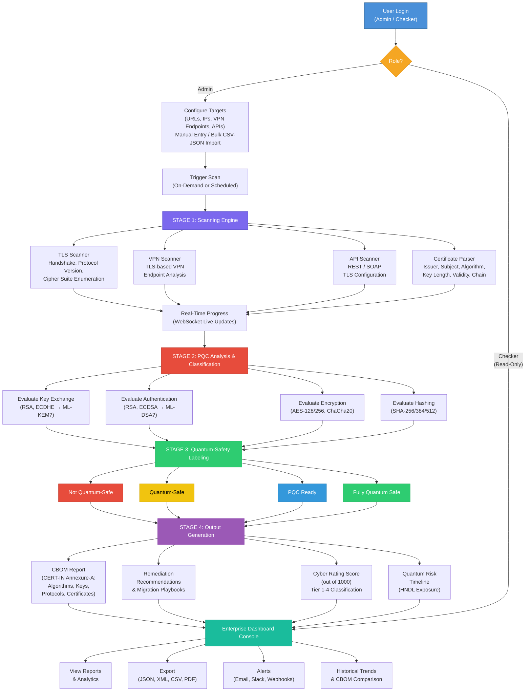

# Punjab National Bank
**Name you can BANK upon!**

# Software Requirement Specification (SRS)
**PSB Hackathon 2026**

**Version 1**

**Project Name:** Quantum-Proof Systems Scanner  
**Team Name:**  
**Institute Name:** 

## Revision History

| Version No | Date | Prepared by/Modified by | Significant Changes |
| :--- | :--- | :--- | :--- |
| Draft V1.0 | 13/03/26 | Sheersh Nigam, Akshat Jiwrajka, Arunangshu Karmakar, Simarpreet Singh | |

---

## Declaration
The purpose of this Software Requirements Specification (SRS) document is to identify and document the user requirements for the `<Rakshak>`. The end deliverable software that will be supplied by `<Gabrus>` will comprise of all the requirements documented in the current document and will be operated in the manner specified in the document. The Source code will be developed subsequently based on these requirements and will formally go through code review during testing process.

**Team Member Details:**
* **Member 1 (Team Lead):**
    * **Sheersh Nigam**
    * **IIT Kharagpur**
    * **Signature:**
    * **Date: 13/03/26**
* **Member 2 (Developer):**
    * **Akshat Jiwrajka**
    * **IIT Kharagpur**
    * **Signature:**
    * **Date: 13/03/26**
* **Member 3 (Analyst):**
    * **Arunangshu Karmakar**
    * **IIT Kharagpur**
    * **Signature:**
    * **Date: 13/03/26**
* **Member 4 (Tester):**
    * **Simarpreet Singh**
    * **IIT Kharagpur**
    * **Signature:**
    * **Date: 13/03/26**

## Table of Content
1. Introduction
   1.1 Purpose
   1.2 Scope
   1.3 Intended Audience
2. Overall Description
   2.1 Product Perspective
   2.2 Product Functions
   2.3 User Classes and Characteristics
   2.4 Operating Environment
   2.5 Design and Implementation Constraints
   2.6 Assumptions and Dependencies
3. Specific Requirements
   3.1 Functional Requirements
   3.2 External Interface Requirements
       3.2.1 User Interfaces
       3.2.2 Hardware Interfaces
       3.2.3 Software/ Communication Interfaces
   3.3 System Features
   3.4 Non-functional Requirements
       3.4.1 Performance Requirements
       3.4.2 Software Quality Attributes
       3.4.3 Other Non-functional Requirements
4. Technological Requirements
   4.1 Technologies used in development of the web application
   4.2 I.D.E. (Integrated Development Environment)
   4.3 Database Management Software
5. Security Requirements
   Annexure-A (CERT-IN CBOM elements)

---

## 1. Introduction

### 1.1 Purpose
To develop a quantum-proof cryptographic scanner that
discovers, inventories, and validates the cryptographic posture of public-facing
banking applications against NIST PQC standards.

### 1.2 Scope
This document is prepared with the following objectives:
* To provide behaviour of the system.
* To provide Process Flow charts.
* Discover cryptographic inventory (TLS certificates, VPN endpoints, APIs).
* Identify cryptographic controls (cipher suites, key exchange mechanisms, TLS versions).
* Validate whether deployed algorithms are quantum-safe.
* Generate actionable recommendations for non-PQC ready assets.
* Issue digital labels: Quantum-Safe, PQC Ready, or Fully Quantum Safe.
* Enterprise wide console for Central management: A GUI console to display status of scanned systems (public facing applications) covering details mentioned in Appendix-A (Cert-In CBOM Elements).
* As per the variation of score (like High, Medium, Low rating etc) for any public applications, dashboard should display that change as well.

#### System Process Flow

### 1.3 Intended Audience
The intended audience of this document is business and technical users from PNB.

---

## 2. Overall Description

### 2.1 Product Perspective

**Rakshak** is a new, standalone quantum-proof cryptographic scanner introduced into Punjab National Bank's cybersecurity ecosystem. It does not replace any existing system; rather, it adds a new capability — the ability to discover, inventory, and validate the cryptographic posture of all public-facing applications (Web Servers, APIs, and Systems including TLS-based VPNs) against NIST Post-Quantum Cryptography (PQC) standards (FIPS 203/204/205).

**Why it is needed:** With the rapid digitalization of banking, PNB's critical applications are publicly accessible 24×7. While secured by classical cryptographic algorithms (RSA, ECC) today, these are vulnerable to the emerging quantum computing threat. Adversaries can execute **"Harvest Now, Decrypt Later" (HNDL)** attacks — intercepting encrypted data now for decryption once quantum computers mature. Rakshak provides proactive defense by identifying vulnerable assets and guiding PNB's transition to quantum-safe cryptography.

**System positioning:** Rakshak is deployed within PNB's intranet with outbound access to public-facing endpoints on port 443 for scanning. It performs **passive, non-intrusive** TLS handshakes only — no write operations on target systems and no disruption to live banking services. It exposes a REST API layer (HTTPS/JSON) enabling future integration with existing SIEM platforms or security dashboards, and supports Webhook notifications for pushing alerts to external systems.

**Data flow:** Targets are scanned → cryptographic details extracted (TLS versions, cipher suites, certificates, key exchange mechanisms) → evaluated against NIST PQC standards → a **Cryptographic Bill of Materials (CBOM)** is generated per CERT-IN Annexure-A → quantum-safety labels are assigned → actionable remediation recommendations are produced — all presented through an enterprise-wide web console with dashboards, risk ratings, and exportable reports.

**Users:** Two roles — **Admin** (cybersecurity teams, IT administrators — full access) and **Checker** (compliance auditors, risk managers — read-only access).

**External dependencies:** SMTP server (email notifications), NTP server (accurate timestamping), optionally Slack API (alert delivery).

### 2.2 Product Functions
1. Target input (URLs, IPs, TLS-based VPN endpoints, APIs) with input validation and bulk CSV/JSON import
2. TLS scanning — perform TLS handshakes, extract protocol version, and enumerate all supported cipher suites
3. TLS-based VPN endpoint scanning — assess cryptographic posture of VPN services
4. API endpoint scanning — discover and validate TLS configurations of REST and SOAP-based APIs
5. Certificate analysis — extract and parse certificate details (issuer, subject, signature algorithm, public key, validity, chain)
6. Real-time scan monitoring — WebSocket-based live progress updates with per-target status and ETA
7. PQC classification — classify each cryptographic component as Quantum-Safe or Not Quantum-Safe based on NIST PQC standards
8. CBOM generation — produce Cryptographic Bill of Materials per CERT-IN Annexure-A (Algorithms, Keys, Protocols, Certificates)
9. CBOM snapshot comparison — compare two CBOM snapshots to track cryptographic posture changes over time
10. Certificate chain visualization — interactive tree/graph view with quantum-safety color coding at each level
11. Labeling — assign labels: Not Quantum-Safe, Quantum-Safe, PQC Ready, or Fully Quantum Safe
12. Actionable recommendations — generate specific algorithm migration steps for non-PQC ready assets
13. Automated PQC migration playbooks — step-by-step migration guides tailored per asset
14. Quantum risk timeline — projected vulnerability timeline based on quantum computing advancement estimates
15. Authentication & access control — login, password recovery, Role-Based Access Control (Admin / Checker), session management, and audit logging
16. Home overview dashboard — high-level summaries of asset counts, PQC adoption %, CBOM vulnerabilities, and cyber rating
17. Dashboard navigation — persistent sidebar, global search, and time period filters
18. Asset inventory management — maintain, search, sort, and manage all public-facing assets with risk levels and certificate details
19. Asset discovery — discover assets across domains, SSL certificates, IP/subnets, and software with network topology visualization
20. PQC posture module — compliance dashboard (Elite-PQC Ready, Standard, Legacy, Critical) with risk overview and improvement recommendations
21. Cyber rating — consolidated enterprise-level score (out of 1000) with compliance matrix (Tier 1–4) and historical trend analysis
22. Enterprise reporting & export — scheduled and on-demand reports in JSON, XML, CSV, and PDF formats with email, local, and Slack delivery channels
23. Webhook / API notifications — push real-time alerts on scan completion, critical findings, or certificate expiration to external systems

### 2.3 User Classes and Characteristics
**Examples:**
* **Primary Users:** Bank cybersecurity teams, IT administrators.
* **Secondary Users:** Compliance auditors, risk managers.
* Users are expected to have technical knowledge of cryptography and networking.

| User at | User Type | Menus for User |
| :--- | :--- | :--- |
| PNB / IIT Kanpur officials | Admin User | |
| PNB | Checker | |

### 2.4 Operating Environment
The operating environment for the `<project name>` as listed below.
* **Server system**
* **Operating system:**
* **Database:**
* **Platform:**
* **Technology:**
* **API:**

### 2.5 Design and Implementation Constraints
**1. Technical Constraints: - (For Deployment)**
* **Network Configuration:** e.g., The application must support private (intranet) IP addressing. Appropriate firewalls and routing rules must be configured.
* **Hosting Environment:** e.g., Should deploy in intranet i.e. for intranet access.

**2. Security Constraints**
* **Access Control:** e.g. (RBAC)
* **Data Encryption:** e.g., all data transmitted over the internet must be used by HTTPS.

**3. Performance Constraints**
* **Failover Mechanisms:** e.g., Ensure redundancy and failover mechanisms are in place for both environments to maintain availability.

**4. User Interface Constraints**
* **User Experience Consistency:** e.g., Maintain consistent design and navigation elements across both environments to minimize confusion for users switching between them.

**Examples:**
* Must comply with NIST PQC standards.
* Must operate only on public-facing applications.
* Must not disrupt live banking services.
* Must generate reports in machine-readable formats (JSON, XML, CSV).

### 2.6 Assumptions and Dependencies
**Assumptions:**
* **Standard Browser Support-** e.g., It is assumed that end users will be accessing the application using HTML5-compliant browser such as Google Chrome.
* Assumes TLS-based communication is used in all public-facing applications.
* Assumes internet connectivity for scanning endpoints.

**Dependencies:**
* **Database System-** e.g., The application is dependent on Oracle database for data storage. Any maintenance, downtime, or performance issues with the database will directly impact on the application's functionality.
* Depends on NIST PQC algorithms being standardized and available.

---

## 3. Specific Requirements

### 3.1 Functional Requirements

#### Core Scanning & Analysis

| ID | Requirement |
|:---|:---|
| **FR-01** | The system shall accept target inputs including URLs, IP addresses, TLS-based VPN endpoints, and API endpoints for scanning. |
| **FR-02** | The system shall perform a TLS handshake with each target and extract the negotiated protocol version (TLS 1.0, 1.1, 1.2, 1.3). |
| **FR-03** | The system shall enumerate all cipher suites supported by each target, including key exchange, authentication, encryption, and hashing algorithms. |
| **FR-04** | The system shall extract and parse certificate details including issuer name, subject name, signature algorithm, public key algorithm, key length, validity period (Not Valid Before / Not Valid After), and certificate chain. |
| **FR-05** | The system shall discover and scan TLS-based VPN endpoints to assess their cryptographic posture. |
| **FR-06** | The system shall discover and validate API endpoint TLS configurations, including REST and SOAP-based services. |
| **FR-07** | The system shall classify each cryptographic component (key exchange, authentication, encryption, hashing) as Quantum-Safe or Not Quantum-Safe based on NIST PQC standards. |
| **FR-08** | The system shall provide **Real-Time Scan Monitoring** via WebSocket-based live progress updates, showing per-target scan status, current phase (handshake, cipher enumeration, cert parsing), and ETA. |
| **FR-09** | The system shall perform **Input Validation** on all target inputs (URL format, IP address format, CIDR notation, port ranges) before initiating scans, rejecting malformed entries with descriptive error messages. |

#### CBOM & Labeling

| ID | Requirement |
|:---|:---|
| **FR-10** | The system shall generate a Cryptographic Bill of Materials (CBOM) per CERT-IN Annexure-A format, covering all four asset categories: Algorithms, Keys, Protocols, and Certificates with their mandatory fields. |
| **FR-11** | The system shall evaluate each scanned asset's cryptographic posture and assign exactly one of the following labels (listed from least to most quantum-ready): |
| **FR-12** | The system shall generate actionable remediation recommendations for each asset classified as "Not Quantum-Safe" or "Quantum-Safe", including specific algorithm migration steps (e.g., "Upgrade key exchange from ECDHE to ML-KEM (FIPS 203)"). |
| **FR-13** | The system shall support **CBOM Snapshot Comparison** — allowing users to compare two CBOM snapshots taken at different times to track cryptographic posture changes, newly added/removed assets, and migration progress. |
| **FR-14** | The system shall provide **Certificate Chain Visualization** — an interactive tree/graph view showing the full certificate chain from leaf to root CA, with quantum-safety status color-coded at each level. |

**FR-11 — Label Definitions:**

| Label | Criteria | Example |
|:---|:---|:---|
| 🔴 **Not Quantum-Safe** | One or more cryptographic components (key exchange, authentication, encryption, or hashing) use algorithms vulnerable to quantum attacks with no mitigation. | RSA-2048 for key exchange, SHA-1 for hashing |
| 🟡 **Quantum-Safe** | All components use algorithms not currently vulnerable to quantum attacks (e.g., AES-256, SHA-384 — symmetric/hash), but key exchange and/or authentication still rely on classical algorithms (RSA, ECC) that are quantum-vulnerable. | AES-256-GCM encryption + SHA-384 hashing, but ECDHE key exchange |
| 🔵 **PQC Ready** | Key exchange or authentication has been migrated to at least one NIST-standardized PQC algorithm (e.g., ML-KEM for key exchange), but other components may still use classical algorithms. | ML-KEM-768 key exchange + RSA authentication |
| 🟢 **Fully Quantum Safe** | All cryptographic components (key exchange, authentication, encryption, hashing) use quantum-safe or NIST PQC algorithms. | ML-KEM-768 key exchange + ML-DSA authentication + AES-256-GCM encryption + SHA-384 hashing |

> ⚠️ *Note: This is our working interpretation. The "PQC Ready" vs "Fully Quantum Safe" distinction is to be confirmed with PNB during the hackathon.*

#### Reporting & Export

| ID | Requirement |
|:---|:---|
| **FR-15** | The system shall export scan reports in JSON, XML, and CSV formats. |
| **FR-16** | The system shall provide an enterprise-wide console displaying the status of all scanned systems with High/Medium/Low risk ratings (mapped to the Cyber Rating tiers defined in FR-47 through FR-49) per Annexure-A. |
| **FR-17** | The system shall support both **Scheduled Reporting** (recurring reports at configurable frequency — daily, weekly, monthly) and **On-Demand Reporting** (immediate generation). |
| **FR-18** | The system shall allow users to configure report contents by selecting which modules to include (Asset Discovery, Asset Inventory, CBOM, PQC Posture, Cyber Rating). |
| **FR-19** | The system shall support multiple report delivery channels including email, local directory save, and Slack notification. |
| **FR-20** | The system shall support PDF report generation with optional password protection and chart/graph inclusion. |
| **FR-21** | The system shall implement **Webhook / API Notifications** allowing external systems to receive real-time alerts on scan completion, critical findings, or certificate expiration warnings. |

#### Authentication & Access Control

| ID | Requirement |
|:---|:---|
| **FR-22** | The system shall provide a login screen requiring email/username and password for authentication. |
| **FR-23** | The system shall implement a "Forgot Password" recovery mechanism via email. |
| **FR-24** | The system shall enforce Role-Based Access Control (RBAC) with at least two roles: **Admin** (full access — configure targets, schedule scans, manage users) and **Checker** (read-only — view reports, verify compliance). |
| **FR-25** | The system shall enforce **Session Management** policies including: JWT token expiry (configurable, default 30 minutes), automatic session timeout after inactivity, and prevention of concurrent sessions for the same user account. |
| **FR-26** | The system shall maintain **Audit Logs** recording all significant events including: user login/logout, scan initiation/completion, report generation, asset additions/modifications, and configuration changes — each with user ID, timestamp, IP address, and event details. |

#### Dashboard & Navigation

| ID | Requirement |
|:---|:---|
| **FR-27** | The system shall provide a persistent sidebar navigation menu with links to: Home, Asset Inventory, Asset Discovery, CBOM, Posture of PQC, Cyber Rating, and Reporting modules. |
| **FR-28** | The system shall provide a **Home Overview Dashboard** displaying high-level summaries including: total asset discovery counts (domains, IPs, subdomains, cloud assets), PQC adoption percentage, CBOM vulnerability count, Cyber Rating breakdown, and Asset Inventory summary. |
| **FR-29** | The system shall provide a **Global Search** bar enabling users to search across domains, URLs, IP addresses, contacts, Indicators of Compromise (IoCs), and other assets. |
| **FR-30** | The system shall provide a **Time Period Filter** allowing users to specify start and end dates to filter all displayed dashboard data. |

#### Asset Inventory Module

| ID | Requirement |
|:---|:---|
| **FR-31** | The system shall maintain an **Asset Inventory** displaying top-level metrics for Public Web Apps, APIs, Servers, and Total Assets. |
| **FR-32** | The system shall display visual distribution charts for: Asset Risk levels, Expiring Certificates timeline, IP Version Breakdown (IPv4 vs IPv6), and Asset Type Distribution (Critical, High, Medium, Low). |
| **FR-33** | The system shall provide a searchable, sortable data table listing all inventoried assets with columns: Asset Name, URL, IPv4/IPv6 Address, Type, Owner, Risk Level, Certificate Status, Key Length, and Last Scan Timestamp. |
| **FR-34** | The system shall display Nameserver Records including Domain, Hostname, IP Address, Record Type, IPv6 Address, Asset association, TTL, Key Length, Cipher Suite (TLS), and Certificate Authority. |
| **FR-35** | The system shall allow users to manually **Add Assets** and trigger a **Scan All** action across all inventoried assets. |
| **FR-36** | The system shall support **Bulk Target Import** via CSV or JSON file upload, enabling administrators to onboard large numbers of targets at once. |

#### Asset Discovery Module

| ID | Requirement |
|:---|:---|
| **FR-37** | The system shall provide an **Asset Discovery** module with categorized tabs for Domains, SSL Certificates, IP Address/Subnets, and Software. |
| **FR-38** | The system shall support status filtering of discovered assets: New, False Positive/Ignore, Confirmed, and All. |
| **FR-39** | The system shall display detailed discovery tracking tables for each category: Registration Date and Registrar for Domains; Fingerprint and Certificate Authority for SSL; Location, Subnet, ASN, and Netname for IPs. |
| **FR-40** | The system shall render a **Visual Network Topology Graph** mapping connections between IPs, SSL certificates, Web servers, Domains, and scanning tags. |

#### PQC Posture Module

| ID | Requirement |
|:---|:---|
| **FR-41** | The system shall provide a **PQC Compliance Dashboard** categorizing assets into: Elite-PQC Ready, Standard, Legacy, and Critical. |
| **FR-42** | The system shall display Risk Overview charts and Application Status tracking within the PQC module. |
| **FR-43** | The system shall display actionable **Improvement Recommendations** within the PQC Posture module UI, surfacing the remediation steps generated by FR-12 in a categorized panel (e.g., upgrading to TLS 1.3 with PQC cipher suites, implementing ML-KEM for key exchange, updating cryptographic libraries, developing a PQC Migration Plan). |
| **FR-44** | The system shall display detailed individual app profiles showing PQC Support status, Ownership, Exposure level, TLS type, and an assigned Score/Status. |
| **FR-45** | The system shall generate a **Quantum Risk Timeline** — a projected timeline visualization showing when each asset's current cryptographic algorithms are expected to become vulnerable based on quantum computing advancement projections (NIST/CISA estimates), highlighting exposure to **Harvest Now, Decrypt Later (HNDL)** attacks where adversaries intercept encrypted data today for future quantum decryption. |
| **FR-46** | The system shall provide **Automated PQC Migration Playbooks** — auto-generated step-by-step migration guides per asset, tailored to its current cipher suite and target PQC algorithms, with estimated effort and risk assessment. |

#### Cyber Rating Module

| ID | Requirement |
|:---|:---|
| **FR-47** | The system shall compute and display a **Consolidated Enterprise-Level Cyber-Rating Score** as a numerical metric (out of 1000) with a visual dial/gauge indicator. |
| **FR-48** | The system shall maintain a classification table mapping asset status (Legacy, Standard, Elite-PQC) to specific numerical score ranges. |
| **FR-49** | The system shall implement a **Compliance Matrix** defining tiers: Tier 1 (Elite), Tier 2 (Standard), Tier 3 (Needs Improvement), Tier 4 (Critical) — each with defined Security Level, Compliance Criteria (TLS version, cipher strength), and Priority/Action. |
| **FR-50** | The system shall provide a **Historical Trend Analysis** dashboard tracking the organization's overall quantum-readiness score over time with trend lines, showing improvement or regression. |

---

### 3.2 External Interface Requirements

#### 3.2.1 User Interfaces

The application shall provide a **responsive web-based user interface** accessible via modern web browsers (Google Chrome 90+, Mozilla Firefox, Microsoft Edge). The UI shall consist of the following components:

**Global Layout:**
- A **persistent sidebar navigation** menu providing access to all modules: Home, Asset Inventory, Asset Discovery, CBOM, Posture of PQC, Cyber Rating, and Reporting.
- A **top navigation bar** containing: global search bar, time period filter (date range selector), user profile dropdown, and notification bell icon.
- A **login page** with email/username and password fields, "Forgot Password" link, and "Sign In" button.

**Home Overview Dashboard:**
- Summary cards displaying key metrics: total assets discovered (domains, IPs, subdomains, cloud assets), PQC adoption percentage (circular progress indicator), CBOM vulnerability count, and Asset Inventory summary (SSL certificates, software, public-facing services).
- A Cyber Rating breakdown widget showing tier distribution (Excellent, Good, Satisfactory, Needs Improvement).

**Asset Inventory View:**
- Metric cards for Public Web Apps, APIs, Servers, and Total Assets counts.
- Interactive charts: Asset Risk distribution (pie/donut), Expiring Certificates timeline (bar), IP Version Breakdown (pie), Asset Type Distribution by severity (stacked bar).
- A searchable, sortable, paginated data table with columns: Asset Name, URL, IPv4/IPv6, Type, Owner, Risk, Cert Status, Key Length, Last Scan.
- A Nameserver Records sub-section table.
- "Add Asset" button (opens modal form) and "Scan All" action button.

**Asset Discovery View:**
- Tabbed interface for Domains, SSL, IP Address/Subnets, and Software categories.
- Status filter bar: New, False Positive/Ignore, Confirmed, All.
- Detailed tracking tables per category with category-specific columns.
- A **Network Topology Graph** (interactive, zoomable, drag-enabled) showing relationships between discovered assets.

**CBOM View:**
- Summary metric cards: Total Applications, Sites Surveyed, Active Certificates, Weak Cryptography count, Certificate Issues count.
- Analytical charts: Cipher Usage distribution, Top Certificate Authorities, Key Length Distribution, Encryption Protocols breakdown.
- A granular mapping table showing per-application Key Length, Cipher, and Certificate Authority.
- Drill-down capability to view full Annexure-A CBOM detail per asset (all 4 categories: Algorithms, Keys, Protocols, Certificates).

**PQC Posture View:**
- PQC Compliance Dashboard with category cards: Elite-PQC Ready, Standard, Legacy, Critical.
- Risk Overview charts and Application Status tracking.
- Improvement Recommendations panel with actionable items.
- Individual app profile cards showing: PQC Support status, Ownership, Exposure level, TLS type, Score/Status badge.
- Quantum Risk Timeline visualization showing projected vulnerability timelines per asset.

**Cyber Rating View:**
- A large visual dial/gauge indicator showing the Consolidated Enterprise-Level Cyber-Rating Score (out of 1000).
- Classification table mapping asset status to score ranges.
- Compliance Matrix grid defining Tier 1–4 with Security Level, Compliance Criteria, and Priority/Action.
- Historical trend chart showing score changes over time.

**Reporting View:**
- Toggle between Scheduled Reporting and On-Demand Reporting modes.
- Configuration form: Report Type, Frequency (Weekly/Daily/Monthly), Target Asset selection.
- Module inclusion checkboxes: Discovery, Inventory, CBOM, PQC Posture, Cyber Rating.
- Scheduling tools: Date picker, Time picker, Time Zone selector.
- Delivery settings: Email routing, local directory path, Slack notification webhook.
- Output settings: File Format (PDF/JSON/XML/CSV), Password Protection toggle, Include Charts checkbox.

**Label Badges:**
- Color-coded badges displayed on assets across all views:
  - 🟢 **Fully Quantum Safe** — green badge
  - 🔵 **PQC Ready** — blue badge
  - 🟡 **Quantum-Safe** — yellow badge
  - 🔴 **Not Quantum-Safe** — red badge

#### 3.2.2 Hardware Interfaces

- The system requires a **standard server** (physical or virtual) with network access to the public internet on port **443 (HTTPS/TLS)** and optionally port **80 (HTTP)** for redirect detection.
- No specialized hardware is required. The system operates entirely in software.
- The server must have a **network interface** capable of establishing outbound TCP connections to target endpoints for TLS handshakes.
- For TLS-based VPN endpoint scanning, the server must be able to reach port **443** (HTTPS/TLS). Note: Ports 500 (IKE) and 4500 (NAT-T) are UDP-based and outside the scope of TLS-based scanning.
- Minimum recommended hardware: **4-core CPU, 8 GB RAM, 50 GB disk** (scales with number of targets and historical data retention).

#### 3.2.3 Software / Communication Interfaces

**REST API Endpoints:**

The system shall expose the following REST API endpoints, communicating over **HTTPS** using **JSON** as the data interchange format:

| Method | Endpoint | Description |
|:---|:---|:---|
| `POST` | `/api/auth/login` | Authenticate user and return JWT token |
| `POST` | `/api/auth/forgot-password` | Initiate password recovery via email |
| `POST` | `/api/scan` | Submit a new scan request with target list |
| `POST` | `/api/scan/bulk-import` | Upload CSV/JSON file for bulk target import |
| `GET` | `/api/scan/{id}/status` | Get real-time status of a running scan |
| `GET` | `/api/scan/{id}/results` | Retrieve scan results for a specific scan |
| `DELETE` | `/api/scan/{id}` | Cancel or remove a scan |
| `GET` | `/api/assets` | List all inventoried assets (paginated, filterable) |
| `POST` | `/api/assets` | Add a new asset manually |
| `POST` | `/api/assets/discover` | Trigger asset discovery |
| `GET` | `/api/cbom/{id}` | Retrieve CBOM for a specific asset/scan |
| `GET` | `/api/cbom/compare` | Compare two CBOM snapshots (diff) |
| `GET` | `/api/pqc/posture` | Get PQC posture summary |
| `GET` | `/api/pqc/recommendations/{id}` | Get migration playbook for a specific asset |
| `GET` | `/api/rating` | Get enterprise cyber rating score |
| `GET` | `/api/rating/history` | Get historical rating trend data |
| `POST` | `/api/reports/generate` | Generate an on-demand report |
| `POST` | `/api/reports/schedule` | Create a scheduled report |
| `GET` | `/api/reports/export` | Export report in specified format |
| `WebSocket` | `/ws/scan/{id}` | Real-time scan progress stream |
| `POST` | `/api/webhooks` | Register a webhook for event notifications |

**External Service Integrations:**
- **SMTP Server** — For email-based report delivery and password recovery.
- **Slack API** — For Slack-channel notification delivery (via incoming webhook).
- **NTP Server** — For accurate timestamping of scan events and certificate validation.

**Data Formats:**
- All API request/response bodies use **JSON** (`application/json`).
- Report exports support **JSON**, **XML**, **CSV**, and **PDF** formats.
- CBOM output conforms to **CERT-IN Annexure-A** schema.

---

### 3.3 System Features

#### SF-01: Authentication & Access Control

**Description:** Provides secure login, password recovery, and role-based access control to ensure only authorized users can access the system with appropriate privilege levels.

**Stimulus/Response Sequences:**

| Stimulus | Response |
|:---|:---|
| User navigates to the application URL | System displays login page with email/password fields |
| User enters valid credentials and clicks "Sign In" | System authenticates user, issues JWT token, redirects to Home Dashboard |
| User enters invalid credentials | System displays error message: "Invalid email or password" |
| User clicks "Forgot Password" and enters email | System sends password reset link to registered email |
| Admin navigates to user management | System displays user list with role assignments (Admin/Checker) |
| Checker user attempts to access Admin-only feature | System denies access and displays "Insufficient permissions" message |

**Functional Requirements:** FR-22, FR-23, FR-24, FR-25, FR-26

---

#### SF-02: Home Overview Dashboard

**Description:** Provides a centralized, at-a-glance view of the organization's entire cryptographic posture, aggregating key metrics from all modules into a single summary page.

**Stimulus/Response Sequences:**

| Stimulus | Response |
|:---|:---|
| Authenticated user lands on Home page | System displays summary cards for Asset Discovery counts, PQC adoption %, CBOM vulnerability count, Cyber Rating, and Asset Inventory |
| User applies a time period filter | System refreshes all dashboard widgets to reflect data within the selected date range |
| User enters a search query in the global search bar | System displays matching results across domains, URLs, IPs, IoCs, and assets |

**Functional Requirements:** FR-27, FR-28, FR-29, FR-30

---

#### SF-03: Asset Inventory Management

**Description:** Maintains a comprehensive inventory of all known public-facing assets (web apps, APIs, servers), their risk levels, certificate details, and scan history. Enables both manual asset addition and bulk operations.

**Stimulus/Response Sequences:**

| Stimulus | Response |
|:---|:---|
| User navigates to Asset Inventory | System displays metric cards (Web Apps, APIs, Servers, Total) and visual distribution charts |
| User scrolls to the data table | System renders paginated, searchable table of all assets with risk, cert status, key length |
| User clicks "Add Asset" | System opens a modal form to input asset details (URL, IP, type, owner) |
| User fills and submits the Add Asset form | System validates input, adds asset to inventory, and queues it for scanning |
| User clicks "Scan All" | System initiates a scan across all inventoried assets and shows progress indicators |
| User clicks on an asset row | System navigates to a detail view with full cert chain, cipher suite, and CBOM data |

**Functional Requirements:** FR-31, FR-32, FR-33, FR-34, FR-35, FR-36

---

#### SF-04: Asset Discovery Engine

**Description:** Automatically discovers public-facing cryptographic assets across multiple categories (domains, SSL certificates, IP subnets, software) and maps their interconnections through a visual network topology.

**Stimulus/Response Sequences:**

| Stimulus | Response |
|:---|:---|
| User navigates to Asset Discovery | System displays tabbed view (Domains, SSL, IP/Subnets, Software) with status filters |
| User selects a category tab (e.g., Domains) | System displays tracking table with Registration Date, Registrar, and other category-specific fields |
| User applies status filter (e.g., "New") | System filters the table to show only newly discovered assets |
| User marks an asset as "False Positive / Ignore" | System updates asset status and excludes it from future scan reports |
| User marks an asset as "Confirmed" | System moves asset to confirmed inventory for active monitoring |
| User clicks "Network Topology" | System renders an interactive graph showing relationships between IPs, SSLs, servers, and domains |

**Functional Requirements:** FR-37, FR-38, FR-39, FR-40

---

#### SF-05: TLS & VPN & API Scanner Engine

**Description:** Core scanning engine that performs TLS handshakes, enumerates cipher suites, extracts certificate details, and scans VPN and API endpoints for their cryptographic posture.

**Stimulus/Response Sequences:**

| Stimulus | Response |
|:---|:---|
| Admin submits a scan request with a list of targets | System queues targets, initiates TLS handshakes, and begins cipher enumeration per target |
| Scan engine connects to a web server target | System extracts TLS version, all supported cipher suites, full certificate chain, key exchange algorithm, and authentication method |
| Scan engine connects to a TLS-based VPN endpoint | System extracts VPN-specific TLS parameters and cipher suite configuration |
| Scan engine discovers an API endpoint | System validates TLS configuration of the API including protocol version and cipher strength |
| A scan is in progress | System sends real-time progress updates via WebSocket (current phase, target, ETA) |
| Scan completes for a target | System stores results in database and triggers post-scan analysis (PQC classification) |
| Scan fails for a target (unreachable / timeout) | System logs the failure, marks target as "Scan Failed," and continues with remaining targets |

**Functional Requirements:** FR-01, FR-02, FR-03, FR-04, FR-05, FR-06, FR-08, FR-09

---

#### SF-06: PQC Analysis & Classification Engine

**Description:** Analyzes scanned cryptographic data against NIST PQC standards (FIPS 203/204/205), classifies each component's quantum safety, assigns labels, and generates tailored remediation recommendations and migration playbooks.

**Stimulus/Response Sequences:**

| Stimulus | Response |
|:---|:---|
| Scan results are available for a target | System evaluates each cryptographic component (key exchange, auth, encryption, hashing) against NIST PQC criteria |
| Component uses AES-256/SHA-384 (symmetric/hash) | System classifies as "Quantum-Safe" (not vulnerable to quantum via Grover's with sufficient key size) |
| Component uses ML-KEM for key exchange but RSA for auth | System classifies as "PQC Ready" (partial PQC migration) |
| All components use quantum-safe or PQC algorithms | System classifies as "Fully Quantum Safe" |
| Asset is classified as Not Quantum-Safe | System generates remediation recommendations with specific algorithm migration steps |
| User requests a migration playbook for an asset | System generates a step-by-step PQC Migration Playbook tailored to the asset's current cipher suite |
| User views the Quantum Risk Timeline | System displays projected vulnerability timeline based on quantum computing advancement estimates |

**Functional Requirements:** FR-07, FR-11, FR-12, FR-41, FR-42, FR-43, FR-44, FR-45, FR-46

---

#### SF-07: CBOM Generator

**Description:** Generates a complete Cryptographic Bill of Materials conforming to CERT-IN Annexure-A specifications, covering Algorithms, Keys, Protocols, and Certificates with all mandatory fields. Supports snapshot comparison for tracking changes over time.

**Stimulus/Response Sequences:**

| Stimulus | Response |
|:---|:---|
| Scan and classification complete for a target | System auto-generates CBOM with all four Annexure-A categories and mandatory fields |
| User navigates to CBOM module | System displays summary metrics: Total Applications, Sites Surveyed, Active Certificates, Weak Cryptography, Certificate Issues |
| User views analytical charts | System renders Cipher Usage distribution, Top CAs, Key Length Distribution, Encryption Protocol breakdown |
| User clicks on a specific application in the CBOM table | System displays granular CBOM detail: Key Length, Cipher, CA, plus full Annexure-A breakdown |
| User selects "Compare Snapshots" and picks two dates | System generates a diff view highlighting added/removed/changed cryptographic assets between snapshots |
| User views certificate chain for an asset | System renders interactive tree view of the full cert chain with quantum-safety color coding per level |

**Functional Requirements:** FR-10, FR-13, FR-14

---

#### SF-08: Cyber Rating System

**Description:** Computes a consolidated enterprise-level cybersecurity score based on the cryptographic posture of all scanned assets, categorizes assets into compliance tiers, and tracks score progression over time.

**Stimulus/Response Sequences:**

| Stimulus | Response |
|:---|:---|
| User navigates to Cyber Rating module | System displays the enterprise score dial (out of 1000) with current rating |
| System recalculates score after new scan | System updates the score based on weighted evaluation of all asset classifications (Elite-PQC → Legacy → Critical) |
| User views classification table | System shows asset status mapped to numerical score ranges |
| User views Compliance Matrix | System displays Tier 1–4 definitions with Security Level, Compliance Criteria (TLS version, cipher strength), and Priority/Action |
| User views historical trend chart | System displays a time-series graph of the enterprise score over weeks/months, showing improvement or regression |

**Functional Requirements:** FR-47, FR-48, FR-49, FR-50

---

#### SF-09: Enterprise Reporting & Export

**Description:** Comprehensive reporting system supporting both scheduled (recurring) and on-demand report generation, with configurable content, multiple delivery channels, and diverse export formats.

**Stimulus/Response Sequences:**

| Stimulus | Response |
|:---|:---|
| User navigates to Reporting module | System displays Scheduled and On-Demand reporting options |
| User selects "On-Demand Report" and configures options | System generates report immediately with selected modules, format, and delivers to chosen channel |
| Admin configures a Scheduled Report (weekly, email) | System saves schedule, generates report at configured time, and sends via email |
| User selects modules to include (e.g., CBOM + PQC Posture) | System includes only selected module data in the generated report |
| User selects PDF format with password protection | System generates an encrypted PDF with charts and tables included |
| User exports raw data as CSV | System generates downloadable CSV file of scan results |
| External system is registered for webhook notifications | System sends POST request to webhook URL on scan completion or critical findings |

**Functional Requirements:** FR-15, FR-16, FR-17, FR-18, FR-19, FR-20, FR-21

---

### 3.4 Non-functional Requirements
#### 3.4.1 Performance Requirements
*(Details to be filled)*
#### 3.4.2 Software Quality Attributes
*(Details to be filled)*
#### 3.4.3 Other Non-functional Requirements
*(Details to be filled)*

---

## 4. Technological Requirements
* **4.1 Technologies used in development of the web application:** e.g., Java, JSP, Servlet or other
* **4.2 I.D.E. (Integrated Development Environment):** e.g., Eclipse or other.
* **4.3 Database Management Software:** e.g., Oracle SQL or other.

---

## 5. Security Requirements
The following points shall be considered at a minimum while preparing the security requirements for the system or system application:
* Compatibility of the proposed system with current IT set up. Impact on existing systems should be estimated (e.g. Existing system would not be affected).
* Audit Trails for all important events capturing details like user ID, time and date, event etc. (e.g. All the responses received from API are logged in DB).
* Control Access to Information and computing facilities based on principals like 'segregation of duty', 'need-to-know', etc (e.g. Only Admin user will be able to schedule the application).
* Recoverability of Application in case of Failure (e.g. Will be recovered from DR).
* Compliance with any legal, statutory and contractual obligations.
* Security vulnerabilities involved when connecting with other systems and applications (e.g. Will be found during Audit).
* Operating environment security (e.g. TLS 1.2).
* Cost of providing security to the system over its life cycle (includes hardware, software, personnel and training).

---

## Annexure-A (CERT-IN CBOM elements)

**Table 9: Minimum Elements pertaining to Cryptographic Asset**

| Cryptographic Asset Type | Element | Description |
| :--- | :--- | :--- |
| **Algorithms** | Name | The name of the cryptographic algorithm or asset. For example, "AES-128-GCM" refers to the AES algorithm with a 128-bit key in Galois/Counter Mode (GCM). |
| | Asset Type | Specifies the type of cryptographic asset. For algorithms, the asset type is "algorithm". |
| | Primitive | Describes the cryptographic primitive. For "SHA512withRSA", the primitive is "signature" as it's used for digital signing. |
| | Mode | The operational mode used by the algorithm. For example, "gcm" refers to the Galois/Counter Mode used with AES encryption. |
| | Crypto Functions | The cryptographic functions supported by the asset. For example, the functions in the case of "AES-128-GCM" are key generation, encryption, decryption, and authentication tag generation. |
| | Classical security level | The classical security level represents the strength of the cryptographic asset in terms of its resistance to attacks using classical (non-quantum) methods. For AES-128, it's 128 bits. |
| | OID | The Object Identifier (OID) is a globally unique identifier used to refer to the algorithm. It helps in distinguishing algorithms across different systems. For example, "2.16.840.1.101.3.4.1.6" for AES-128-GCM, "1.2.840.113549.1.1.13" for SHA512withRSA |
| | List | Lists the cryptographic algorithms employed by the quantum device or system, allowing for an assessment of its security capabilities, especially in the context of post-quantum encryption standards. |
| **Keys** | Name | The name of the key, which is a unique identifier for the key used in cryptographic operations. |
| | Asset Type | Defines the type of cryptographic asset. For keys, the asset type is typically "key". |
| | id | A unique identifier for the key, such as a key ID or reference number. |
| | state | The state of the key, such as whether it is active, revoked, or expired. |
| | size | The size of the key, typically measured in bits. For example, a 128-bit key or a 2048-bit RSA key. |
| | Creation Date | The date when the key was created. |
| | Activation Date | The date when the key became operational or was first used. |
| **Protocols** | Name | The name of the cryptographic protocol, such as TLS, IPsec, or SSH |
| | Asset Type | Defines the type of cryptographic asset. In this case, it would be a "protocol" |
| | Version | The version of the protocol used, such as TLS 1.2 or TLS 1.3. |
| | Cipher Suites | The set of cryptographic algorithms and parameters supported by the protocol for tasks like encryption, key exchange, and integrity checking. |
| | OID | The Object Identifier (OID) associated with the protocol, identifying its unique specifications. |
| **Certificates** | Name | The name of the certificate, typically referring to its subject or the entity it represents (e.g., a website). |
| | Asset Type | Defines the type of cryptographic asset. For certificates, the asset type is "certificate". |
| | Subject Name | This refers to the Distinguished Name (DN) of the entity that the certificate represents. It typically contains information about the organization, domain name |
| | Issuer Name | The issuer is the Certificate Authority (CA) that issued and signed the certificate. This field contains the DN of the CA that verified and issued the certificate. |
| | Not Valid Before | This specifies the date and time from which the certificate is valid. |
| | Not Valid After | This specifies the expiration date and time of the certificate. The certificate becomes invalid after this timestamp. |
| | Signature Algorithm Reference | This refers to the cryptographic algorithm used to sign the certificate. It provides a reference to the algorithm and its OID (Object Identifier). |
| | Subject Public Key Reference | This points to the public key used by the subject (the entity being identified in the certificate). It provides a reference to the key's details, including the algorithm. |
| | Certificate Format | Specifies the format of the certificate. Common formats include X.509, which is the most widely used format for certificates. |
| | Certificate Extension | This refers to the file extension associated with the certificate. It is commonly .crt for certificates in the X.509 format. |