# Rakshak — Prototype Implementation Plan

## Goal
Build a fully functional prototype of **Rakshak**, the Quantum-Proof Systems Scanner, covering all 50 functional requirements (FR-01 to FR-50) and 9 system features (SF-01 to SF-09) defined in the SRS, using the approved tech stack: **Python 3.11+ / FastAPI / Jinja2 / HTML-CSS-JS / SQLite (dev)**.

---

## Architecture Overview

```mermaid
graph TD
    subgraph Frontend["Frontend (Jinja2 + HTML/CSS/JS)"]
        UI_Auth["Login / Auth Pages"]
        UI_Home["Home Dashboard"]
        UI_Inv["Asset Inventory"]
        UI_Disc["Asset Discovery"]
        UI_CBOM["CBOM Module"]
        UI_PQC["PQC Posture"]
        UI_Rating["Cyber Rating"]
        UI_Report["Reporting"]
    end

    subgraph API["FastAPI Backend"]
        Auth["Auth & RBAC (JWT)"]
        ScanAPI["Scan API"]
        AssetAPI["Asset API"]
        CBOMAPI["CBOM API"]
        PQCAPI["PQC API"]
        RatingAPI["Rating API"]
        ReportAPI["Report API"]
        WebhookAPI["Webhook API"]
        WS["WebSocket /ws/scan"]
    end

    subgraph Engine["Scanning & Analysis Engine"]
        TLS["TLS Scanner (sslyze)"]
        VPN["VPN Scanner"]
        APIS["API Scanner"]
        CertP["Certificate Parser (cryptography)"]
        PQCEng["PQC Classifier"]
        CBOMGen["CBOM Generator"]
        RatingEng["Cyber Rating Engine"]
        PlaybookGen["Migration Playbook Generator"]
    end

    subgraph Data["Data Layer"]
        DB["SQLite (Dev) / PostgreSQL (Prod)"]
        Models["SQLAlchemy ORM Models"]
    end

    Frontend --> API --> Engine --> Data
```



---

## Project Structure

```
a:\Shared\psb-cyber-2026\rakshak/
├── app/
│   ├── main.py                    # FastAPI app entry point
│   ├── config.py                  # Settings, env vars
│   ├── database.py                # DB engine, session, Base
│   │
│   ├── models/                    # SQLAlchemy ORM models
│   │   ├── user.py                # User, Role
│   │   ├── asset.py               # Asset, AssetDiscovery
│   │   ├── scan.py                # Scan, ScanResult
│   │   ├── cbom.py                # CBOM snapshots
│   │   ├── report.py              # Report, ScheduledReport
│   │   ├── audit.py               # AuditLog
│   │   └── webhook.py             # Webhook registrations
│   │
│   ├── schemas/                   # Pydantic request/response schemas
│   │   ├── auth.py
│   │   ├── asset.py
│   │   ├── scan.py
│   │   ├── cbom.py
│   │   ├── report.py
│   │   └── webhook.py
│   │
│   ├── routers/                   # FastAPI route handlers
│   │   ├── auth.py                # POST /api/auth/login, /forgot-password
│   │   ├── scan.py                # POST /api/scan, GET /api/scan/{id}/status
│   │   ├── assets.py              # GET/POST /api/assets, /discover
│   │   ├── cbom.py                # GET /api/cbom/{id}, /compare
│   │   ├── pqc.py                 # GET /api/pqc/posture, /recommendations
│   │   ├── rating.py              # GET /api/rating, /history
│   │   ├── reports.py             # POST /api/reports/generate, /schedule
│   │   ├── webhooks.py            # POST /api/webhooks
│   │   └── ws.py                  # WebSocket /ws/scan/{id}
│   │
│   ├── engine/                    # Core scanning & analysis
│   │   ├── tls_scanner.py         # TLS handshake, cipher enumeration (sslyze)
│   │   ├── vpn_scanner.py         # TLS-based VPN scanning
│   │   ├── api_scanner.py         # REST/SOAP API TLS scanning
│   │   ├── cert_parser.py         # X.509 certificate parsing (cryptography lib)
│   │   ├── pqc_classifier.py      # PQC analysis & labeling engine
│   │   ├── cbom_generator.py      # CBOM generation per CERT-IN Annexure-A
│   │   ├── rating_engine.py       # Cyber rating score computation
│   │   ├── playbook_generator.py  # PQC migration playbook generation
│   │   ├── risk_timeline.py       # Quantum risk timeline projections
│   │   └── plugins/               # Plugin architecture for extensibility
│   │       └── base_plugin.py     # Plugin base class
│   │
│   ├── services/                  # Business logic layer
│   │   ├── auth_service.py        # JWT, password hashing, reset
│   │   ├── scan_service.py        # Orchestrates scan lifecycle
│   │   ├── asset_service.py       # Asset CRUD, bulk import
│   │   ├── report_service.py      # Report generation, scheduling
│   │   ├── export_service.py      # JSON/XML/CSV/PDF export
│   │   ├── notification_service.py # Email, Slack, Webhook dispatch
│   │   └── audit_service.py       # Audit log recording
│   │
│   ├── templates/                 # Jinja2 HTML templates
│   │   ├── base.html              # Layout: sidebar + top nav + content
│   │   ├── login.html             # Login page (FR-22, FR-23)
│   │   ├── home.html              # Home dashboard (FR-27–30)
│   │   ├── asset_inventory.html   # Asset inventory (FR-31–36)
│   │   ├── asset_discovery.html   # Asset discovery (FR-37–40)
│   │   ├── cbom.html              # CBOM module (FR-10, FR-13, FR-14)
│   │   ├── pqc_posture.html       # PQC posture (FR-41–46)
│   │   ├── cyber_rating.html      # Cyber rating (FR-47–50)
│   │   ├── reporting.html         # Reporting (FR-15–21)
│   │   └── user_management.html   # Admin: user management
│   │
│   └── static/                    # CSS, JS, images
│       ├── css/
│       │   └── style.css          # Main stylesheet (dark theme, modern design)
│       ├── js/
│       │   ├── app.js             # Global utilities
│       │   ├── dashboard.js       # Chart rendering (Chart.js)
│       │   ├── scan.js            # WebSocket scan progress
│       │   ├── topology.js        # Network topology graph (D3.js / vis.js)
│       │   ├── cert_tree.js       # Certificate chain tree visualization
│       │   └── timeline.js        # Quantum risk timeline
│       └── img/
│
├── tests/                         # Test suite
│   ├── test_tls_scanner.py
│   ├── test_pqc_classifier.py
│   ├── test_cbom_generator.py
│   ├── test_rating_engine.py
│   └── test_api.py
│
├── requirements.txt
├── .env.example
└── README.md
```

---

## Component Breakdown & SRS Mapping

### Phase 1 — Foundation (Core Infrastructure)

#### 1. Project Setup & Database

| Files | What to Do |
|:---|:---|
| `main.py` | FastAPI app with CORS, static files mount, Jinja2 template config, router includes |
| `config.py` | Settings via Pydantic `BaseSettings` (DB URL, JWT secret, SMTP, Slack webhook) |
| `database.py` | SQLAlchemy async engine, session maker, `Base` declarative class |
| `requirements.txt` | `fastapi`, `uvicorn`, `sqlalchemy`, `sslyze`, `cryptography`, `python-jose`, `passlib`, `jinja2`, `python-multipart`, `aiofiles`, `websockets`, `httpx`, `reportlab` (PDF), `dicttoxml`, `aiosmtplib` |

#### 2. Data Models (`models/`)

| Model | Key Fields | SRS Mapping |
|:---|:---|:---|
| `User` | id, email, username, hashed_password, role (Admin/Checker), is_active | FR-22, FR-24 |
| `Asset` | id, name, url, ipv4, ipv6, type (web/api/vpn/server), owner, risk_level, cert_status, key_length, last_scan | FR-31, FR-33 |
| `AssetDiscovery` | id, category (domain/ssl/ip/software), status (new/confirmed/false_positive), metadata_json | FR-37, FR-38, FR-39 |
| `Scan` | id, status, started_at, completed_at, target_count, progress_pct, created_by | FR-01, FR-08 |
| `ScanResult` | id, scan_id, asset_id, tls_version, cipher_suites_json, cert_chain_json, pqc_label, pqc_details_json, recommendations_json | FR-02–07, FR-11, FR-12 |
| `CBOMSnapshot` | id, scan_id, asset_id, algorithms_json, keys_json, protocols_json, certificates_json, created_at | FR-10, FR-13 |
| `Report` | id, type, format, modules_json, schedule_cron, delivery_channel, created_by | FR-15–20 |
| `AuditLog` | id, user_id, event_type, event_details, ip_address, timestamp | FR-26 |
| `Webhook` | id, url, events_json, secret, is_active | FR-21 |

---

### Phase 2 — Auth & Navigation Shell (SF-01, SF-02)

| Component | What to Build | SRS Refs |
|:---|:---|:---|
| `routers/auth.py` | `POST /api/auth/login` → JWT token; `POST /api/auth/forgot-password` → email reset link | FR-22, FR-23 |
| `services/auth_service.py` | Password hashing (bcrypt), JWT creation/validation, session timeout (30 min default), concurrent session prevention | FR-25 |
| `templates/login.html` | Login page with email/password fields, "Forgot Password" link, "Sign In" button | FR-22 |
| `templates/base.html` | Persistent sidebar (Home, Asset Inventory, Asset Discovery, CBOM, PQC Posture, Cyber Rating, Reporting), top nav with search bar, time period filter, user profile dropdown, notification bell | FR-27, FR-29, FR-30 |
| RBAC middleware | Dependency injection checking `current_user.role` — Admin gets all, Checker gets read-only | FR-24 |
| `services/audit_service.py` | Log login/logout, scan events, report gen, config changes with user ID, timestamp, IP | FR-26 |

---

### Phase 3 — Scanning Engine (SF-05)

| Component | What to Build | SRS Refs |
|:---|:---|:---|
| `engine/tls_scanner.py` | Use `sslyze` to: perform TLS handshake, extract TLS version (1.0–1.3), enumerate all cipher suites (key exchange, auth, encryption, hashing) | FR-02, FR-03 |
| `engine/cert_parser.py` | Use `cryptography` lib to: parse X.509 cert (issuer, subject, sig algorithm, public key algo, key length, validity, chain) | FR-04 |
| `engine/vpn_scanner.py` | Extend TLS scanner for VPN endpoints (TLS-based VPN on port 443) | FR-05 |
| `engine/api_scanner.py` | Probe REST/SOAP API endpoints for TLS config | FR-06 |
| `routers/scan.py` | `POST /api/scan` (submit targets), `GET /api/scan/{id}/status`, `GET /api/scan/{id}/results`, `DELETE /api/scan/{id}` | API spec |
| `routers/ws.py` | WebSocket `/ws/scan/{id}` → push real-time progress (phase, target, ETA) | FR-08 |
| `services/scan_service.py` | Orchestrate scan: validate inputs (FR-09), queue targets, run concurrently (asyncio), track progress, handle failures (log + mark "Scan Failed"), store results, trigger post-scan PQC analysis | FR-01, FR-08, FR-09 |
| Input validation | URL format, IP format, CIDR notation, port ranges — reject malformed with descriptive errors | FR-09 |
| Dynamic throttling | Auto-adjust handshake velocity to avoid WAF/rate-limiting | NFR (3.4.1) |

---

### Phase 4 — PQC Analysis & Classification (SF-06)

| Component | What to Build | SRS Refs |
|:---|:---|:---|
| `engine/pqc_classifier.py` | Evaluate each component against NIST PQC standards (FIPS 203/204/205). Classify: **Key Exchange** (RSA/ECDHE → vulnerable; ML-KEM → PQC), **Authentication** (RSA/ECDSA → vulnerable; ML-DSA/SLH-DSA → PQC), **Encryption** (AES-128 → quantum-safe w/ caveat; AES-256 → quantum-safe), **Hashing** (SHA-256+ → quantum-safe; SHA-1 → not safe) | FR-07 |
| Labeling logic | Apply label rules: 🔴 Not QS (any vulnerable component), 🟡 QS (symmetric/hash safe but classical KX/auth), 🔵 PQC Ready (≥1 PQC algo in KX or auth), 🟢 Fully QS (all components PQC/safe) | FR-11 |
| `engine/playbook_generator.py` | Generate per-asset migration playbooks: current cipher → target PQC cipher, step-by-step guide, estimated effort, risk | FR-12, FR-46 |
| `engine/risk_timeline.py` | Project vulnerability timeline based on NIST/CISA quantum computing estimates + HNDL exposure window | FR-45 |
| Plugin architecture | `engine/plugins/base_plugin.py` — abstract base for rule plugins, loadable at runtime without recompilation | NFR (3.4.2) |

---

### Phase 5 — CBOM Generator (SF-07)

| Component | What to Build | SRS Refs |
|:---|:---|:---|
| `engine/cbom_generator.py` | Generate CBOM per CERT-IN Annexure-A with 4 categories: **Algorithms** (name, type, primitive, mode, crypto functions, classical security level, OID, list), **Keys** (name, type, id, state, size, creation date, activation date), **Protocols** (name, type, version, cipher suites, OID), **Certificates** (name, type, subject, issuer, validity, sig algo ref, public key ref, format, extension) | FR-10 |
| Snapshot storage | Store each CBOM as a timestamped immutable snapshot | FR-13 |
| Snapshot comparison | Diff two snapshots: added/removed/changed assets, migration progress tracking | FR-13 |
| `engine/cert_parser.py` (extend) | Certificate chain visualization data: tree structure from leaf→intermediate→root CA with PQC label at each level | FR-14 |

---

### Phase 6 — Dashboard Pages (SF-02, SF-03, SF-04)

| Template | Key Widgets | SRS Refs |
|:---|:---|:---|
| `home.html` | Summary cards (asset counts, PQC adoption %, CBOM vulnerabilities, cyber rating breakdown, asset inventory summary). Chart.js for visualizations. Time filter + global search wired up. | FR-27, FR-28, FR-29, FR-30 |
| `asset_inventory.html` | Metric cards (Web Apps, APIs, Servers, Total). Charts: risk distribution (donut), expiring certs (bar), IPv4 vs IPv6 (pie), severity distribution (stacked bar). Searchable/sortable/paginated table. Nameserver records section. "Add Asset" modal + "Scan All" button. Bulk import (CSV/JSON upload). | FR-31–36 |
| `asset_discovery.html` | Tabs: Domains / SSL / IP-Subnets / Software. Status filter bar. Category-specific tracking tables. Network topology graph (D3.js / vis.js). | FR-37–40 |
| `cbom.html` | Summary metrics (apps, sites, certs, weak crypto, cert issues). Charts: cipher usage, top CAs, key length distribution, encryption protocols. Per-app CBOM table with drill-down. Snapshot comparison view. Cert chain tree visualization. | FR-10, FR-13, FR-14 |
| `pqc_posture.html` | Compliance dashboard cards (Elite-PQC, Standard, Legacy, Critical). Risk overview charts. Improvement recommendations panel. Individual app profiles (PQC support, ownership, exposure, TLS, score). Quantum Risk Timeline visualization. Migration playbook viewer. | FR-41–46 |
| `cyber_rating.html` | Score dial/gauge (out of 1000). Classification table. Compliance matrix (Tier 1–4). Historical trend chart. | FR-47–50 |
| `reporting.html` | Toggle: Scheduled vs On-Demand. Config form: type, frequency, target assets. Module checkboxes. Date/time/timezone pickers. Delivery settings (email, local, Slack). Format settings (PDF/JSON/XML/CSV) + password protection toggle + charts checkbox. | FR-15–20 |

---

### Phase 7 — Reporting & Notifications (SF-09)

| Component | What to Build | SRS Refs |
|:---|:---|:---|
| `services/export_service.py` | Export to JSON, XML (dicttoxml), CSV, PDF (reportlab with charts + optional password protection) | FR-15, FR-20 |
| `services/report_service.py` | On-demand generation + scheduled recurring (daily/weekly/monthly via background task / APScheduler) | FR-17 |
| Report content config | Module selection: Discovery, Inventory, CBOM, PQC Posture, Cyber Rating | FR-18 |
| `services/notification_service.py` | Email (aiosmtplib/SMTP), Slack (incoming webhook), Webhook POST dispatch | FR-19, FR-21 |
| `routers/webhooks.py` | `POST /api/webhooks` → register webhook URL + events (scan_complete, critical_finding, cert_expiration) | FR-21 |

---

### Phase 8 — Cyber Rating Engine (SF-08)

| Component | What to Build | SRS Refs |
|:---|:---|:---|
| `engine/rating_engine.py` | Weighted scoring: aggregate all asset labels → enterprise score (0–1000). Classification: Elite-PQC ↔ score ranges. Tier mapping: Tier 1 (Elite) / Tier 2 (Standard) / Tier 3 (Needs Improvement) / Tier 4 (Critical) with compliance criteria (TLS version, cipher strength). | FR-47, FR-48, FR-49 |
| Historical tracking | Store score per scan run → trend line data for `GET /api/rating/history` | FR-50 |

---

### Phase 9 — Polish & Non-Functional Requirements

| Concern | Implementation | SRS Refs |
|:---|:---|:---|
| Concurrency | `asyncio` + sslyze async scanning, 50+ simultaneous targets | NFR 3.4.1 |
| Performance | Scan < 30s per target, dashboard < 3s load, reports < 5s generation | NFR 3.4.1 |
| Logging | Python `logging` module, all events with timestamps | NFR 3.4.3 |
| Audit trail hashing | SHA-256 hash on each audit log entry for tamper evidence | §5 Security |
| RBAC enforcement | Middleware on every route; Admin = full, Checker = GET only | FR-24 |
| HTTPS | Uvicorn with SSL cert for development; reverse proxy (nginx) for production | §5 Security |
| Session management | JWT expiry (configurable, default 30 min), concurrent session block | FR-25 |
| Responsive UI | CSS media queries, mobile-friendly sidebar collapse | NFR 3.4.2 |
| User Management page | Admin-only page to list users, assign roles | FR-24 |

---

## FR Coverage Checklist

| FR | Description | Phase |
|:---|:---|:---|
| FR-01 | Target input (URLs, IPs, VPNs, APIs) | 3 |
| FR-02 | TLS handshake + protocol version | 3 |
| FR-03 | Cipher suite enumeration | 3 |
| FR-04 | Certificate parsing | 3 |
| FR-05 | VPN endpoint scanning | 3 |
| FR-06 | API endpoint scanning | 3 |
| FR-07 | PQC classification | 4 |
| FR-08 | Real-time WebSocket progress | 3 |
| FR-09 | Input validation | 3 |
| FR-10 | CBOM generation (Annexure-A) | 5 |
| FR-11 | Quantum-safety labeling (4 labels) | 4 |
| FR-12 | Remediation recommendations | 4 |
| FR-13 | CBOM snapshot comparison | 5 |
| FR-14 | Certificate chain visualization | 5 |
| FR-15 | Export: JSON, XML, CSV | 7 |
| FR-16 | Enterprise console w/ risk ratings | 6 |
| FR-17 | Scheduled + On-Demand reporting | 7 |
| FR-18 | Report module selection | 7 |
| FR-19 | Multi-channel delivery (email, local, Slack) | 7 |
| FR-20 | PDF w/ password + charts | 7 |
| FR-21 | Webhook/API notifications | 7 |
| FR-22 | Login screen | 2 |
| FR-23 | Forgot password | 2 |
| FR-24 | RBAC (Admin/Checker) | 2 |
| FR-25 | Session management (JWT) | 2 |
| FR-26 | Audit logs | 2 |
| FR-27 | Sidebar navigation | 2 |
| FR-28 | Home overview dashboard | 6 |
| FR-29 | Global search | 6 |
| FR-30 | Time period filter | 6 |
| FR-31 | Asset inventory metrics | 6 |
| FR-32 | Distribution charts | 6 |
| FR-33 | Searchable asset table | 6 |
| FR-34 | Nameserver records | 6 |
| FR-35 | Add Asset + Scan All | 6 |
| FR-36 | Bulk CSV/JSON import | 6 |
| FR-37 | Asset discovery tabs | 6 |
| FR-38 | Status filtering | 6 |
| FR-39 | Category tracking tables | 6 |
| FR-40 | Network topology graph | 6 |
| FR-41 | PQC compliance dashboard | 6 |
| FR-42 | Risk overview charts | 6 |
| FR-43 | Improvement recommendations UI | 6 |
| FR-44 | Individual app profiles | 6 |
| FR-45 | Quantum risk timeline | 4 |
| FR-46 | Migration playbooks | 4 |
| FR-47 | Enterprise cyber rating score | 8 |
| FR-48 | Classification table | 8 |
| FR-49 | Compliance matrix (Tier 1–4) | 8 |
| FR-50 | Historical trend analysis | 8 |

> All 50 FRs and all 9 System Features (SF-01 through SF-09) are covered.

---

## Key Technology Choices

| Purpose | Library / Tool | Rationale |
|:---|:---|:---|
| TLS Scanning | `sslyze` | Industry-standard, async, enumerates cipher suites, protocol versions |
| Cert Parsing | `cryptography` | Full X.509 parsing — issuer, subject, chain, algorithms, key lengths |
| Backend Framework | `FastAPI` | High-performance async, built-in OpenAPI docs, WebSocket support |
| ORM | `SQLAlchemy` (async) | Supports SQLite (dev) and PostgreSQL (prod) from same codebase |
| Templating | `Jinja2` | Native FastAPI integration, server-side rendering |
| Charts | `Chart.js` (frontend) | Lightweight, responsive charts — donut, bar, line, gauge |
| Network Graph | `vis.js` or `D3.js` | Interactive topology visualization with zoom/drag |
| PDF Export | `ReportLab` | Programmatic PDF generation with charts and password protection |
| XML Export | `dicttoxml` | Simple dict → XML conversion |
| Email | `aiosmtplib` | Async SMTP for notifications and report delivery |
| Scheduling | `APScheduler` | Cron-like scheduled report generation |
| Auth | `python-jose` + `passlib` | JWT tokens + bcrypt password hashing |

---

## User Review Required

> [!IMPORTANT]
> **Prototype scope vs. production scope**: Some features like SMTP email delivery, Slack integration, and NTP sync require external service configuration. For the prototype/hackathon demo, these can be mocked or use local fallbacks (e.g., console-logging emails, mock Slack responses). The scan engine will be fully real against `sslyze`.

> [!IMPORTANT]
> **Database**: Using SQLite for the prototype (zero config). The ORM layer with SQLAlchemy makes switching to PostgreSQL trivial for production.

> [!WARNING]
> **The Scanning Engine will perform REAL TLS handshakes** against target URLs/IPs. Targets should be your own test endpoints or well-known public sites you have permission to scan. The scanner is passive (read-only handshakes), but be mindful of rate limits.

### Questions for the Team

1. **Hackathon timeline** — How many days do we have for the prototype build? This determines whether we parallelize phases or go sequential.
2. **Demo targets** — Do we have a list of PNB test endpoints, or should we prepare our own test servers with varying TLS configurations?
3. **UI framework preference** — The SRS specifies HTML/CSS/JS with Jinja2. Should we use any CSS framework (e.g., Bootstrap) for faster UI development, or build the design system from scratch?
4. **Team member assignment** — Should we map phases to team members (e.g., Akshat→Engine, Sheersh→Frontend, Arunangshu→Analysis, Simarpreet→Testing)?

---

## Verification Plan

### Automated Tests
Since this is a greenfield project, we will create the test suite alongside the codebase:

1. **`tests/test_pqc_classifier.py`** — Unit tests for the PQC labeling logic:
   - RSA-2048 + SHA-1 → 🔴 Not Quantum-Safe
   - AES-256 + SHA-384 + ECDHE → 🟡 Quantum-Safe
   - ML-KEM + RSA-auth → 🔵 PQC Ready  
   - ML-KEM + ML-DSA + AES-256 + SHA-384 → 🟢 Fully Quantum Safe
   - Run: `cd rakshak && python -m pytest tests/test_pqc_classifier.py -v`

2. **`tests/test_cbom_generator.py`** — Verify CBOM output conforms to Annexure-A schema (4 categories, all mandatory fields present)
   - Run: `cd rakshak && python -m pytest tests/test_cbom_generator.py -v`

3. **`tests/test_rating_engine.py`** — Verify score computation (0–1000 range, tier classification)
   - Run: `cd rakshak && python -m pytest tests/test_rating_engine.py -v`

4. **`tests/test_api.py`** — FastAPI `TestClient` tests for all REST endpoints:
   - Auth flow (login, JWT, RBAC), asset CRUD, scan submission, report generation
   - Run: `cd rakshak && python -m pytest tests/test_api.py -v`

### Browser-Based Verification
After implementation, use the browser tool to visually verify:

1. **Login flow** — Navigate to `/login`, enter credentials, verify redirection to Home
2. **Dashboard rendering** — Verify all 7 sidebar links work, charts render, summary cards populate
3. **Scan flow** — Submit a scan target, observe WebSocket progress updates, view results
4. **Export** — Generate a report in each format (JSON, CSV, PDF), download and verify
5. **RBAC** — Login as Checker, verify Admin-only actions are blocked

### Manual Verification (by team)
1. **Scan a real endpoint** (e.g., `https://www.pnbindia.in`) and verify:
   - TLS version detected correctly
   - All cipher suites listed
   - Certificate chain displayed
   - PQC label assigned correctly
   - CBOM generated with all Annexure-A fields
2. **Compare two scans** of the same target to verify CBOM snapshot diff works
